update: 25.8.2025  
# Tietokone ja käyttöjärjestelmä
**GPU:** Nvidia RTX 2070  
**Processor:** Intel Core i9-9900K 3.60 Ghz    
**RAM:** 16.0 GB  
**OS:**  Windows 11 Home  

# Raportin kirjoittaminen
Raporttien tarkoituksena on kertoa täsmällisesti mitä on tehnyt. Raportin täsmällisyyteen tulee kiinnittää erityistä huomioita, koska tarkoituksena on, että kuka tahansa muu pystyy toistamaan tehdyt toimenpiteet seuraamalla raporttia. Raporttin tekeminen on tärkeää myös tekijälle. Tämän raportin tekijä voi itse palata myöhemmin raportin pariin ja toistaa vaikeat ja tarkkuutta vaativat toimenpiteet nopeasti, omia muistiinpanojaan seuraten. (Karvinen, T. 2006)  
Hyvän raportin tulee myös olla helppolukuinen. Se tuo tekijästä ammattimaisen ja luotettavan kuvan. Raportointiin kuuluu myös täsmällisyys. Komennot juuri sellaisina kuin ne on tehty. Raporttiin on myös hyvä sisällyttää käytetty aika, päivämäärä ja kellonaika, jolloin voidaan esimerkiksi todeta onko jokin virhetilanne johtunut laajemmasta ongelmasta, johon raportintekijä ei ole voinut itse vaikuttaa.  
Raportti siis tulee tehdä huolellisesti ja täsmällisesti. On tärkeää sisällyttää kaikki onnistumiset ja epäonnistumiset, jolloin mahdollisien virheiden selvittäminen on helpompaa. Työhön on myös hyvä sisällyttää paljon kuvakaappauksia tekemisestään, koska kuva voi havainnollistaa tekovaiheen selkeämmin. Muista myös viitata lähteisiin. (Karvinen 2006)  
# Linuxin asennus virtuaalikoneeseen
## Tiivistelmä
**24.8.25**  
**Aloitusaika**: 16:33  
**Lopetusaika**: 20:00  
**25.8.25**  
**Aloitusaika**: 15:40  
**Lopetusaika**: 16:20  
Tämä raportti sisältää onnistuneen Linuxin asentamisen Oracle Virtual Boxiin. Raportti käsittelee myös hieman tutustumista Markdownin käyttöön. Tämä raportti tehtiin kahden päivän aikana, josta osa ajasta kului Markdownin syntaksin opetteluun. Linuxin ja Virtualboxin asennuksessa on käytetty pääsääntöisesti apuna Karvisen ja Heinosen ohjeita asennuksesta. Isompia ongelmia ei asennuksien aikana syntynyt, ja syntyneet ongelmat sain ratkottua etsimällä tietoa internetistä.
## Kuvien lisääminen Markdowniin
Tutustuin aluksi Tero Karvisen tekemään ohjeeseen, joka löytyi repositorysta nimeltä **dreamhugmonkey**. Avasin README.md tiedoston ja tutkin **Preview**-, sekä **Code**-näkymää. Sain hyvän käsityksen, kuinka kuvan saa lisättyä tekstin sekaan Markdownissa (Karvinen, dreamhugmonkey). Tutkin myös Johanna Heinosen ohjetta: How to Install Linux to Virtualbox? Huomasin, että Heinonen oli laittanut kaikki kuvat **Pictures**-kansion alle, joten halusin käyttää samaa menetelmää (Heinonen 2025). Nopealla googlettamisella löysin kuinka lisätään kansio omaan repositoryyn.  
1. Avaa haluttu repository
2. Create new file
3. Kirjoita kansion nimi
4. Nimen perään lisää merkki "/"
5. Tämän jälkeen voit lisätä haluttuja tiedostoja kansioon  
(SethClydesdale 2019)  
Markdowniin kuva saadaan upotettua seuraavanlaisesti:
```
. 
```
Tämä on testikuva:  
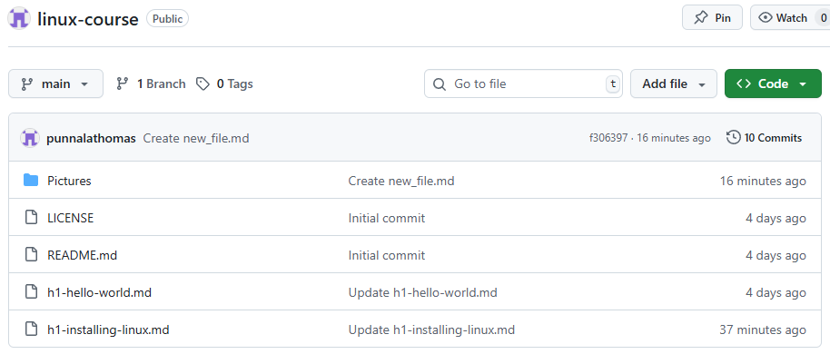
## Virtualboxin asennus
Aloitin Virtualboxin asentamisen avaamalla Heinosen ohjeet ja avaamalla [download Virtualbox sivun](https://www.virtualbox.org/wiki/Downloads) Latasin sivulta VirtualBox 7.2.0 platform packages: Windows host version. Tässä kohtaa siirryin Karvisen(2021) install debian on virtual box ohjeisiin ja käytin niitä hyödyksi Virtual machinen asennukseen. 
1. Avasin ladatun Oracle VirtualBox 7.2.0 installerin
2. Valitsin kovalevyn jossa oli vähintää 30GB vapaata tilaa.
3. Asennusohjelma varoitti nettiyhteyden katkeamisesta, joten pidin huolta, että kaikki tarvittavat tiedostot on tallennettu ennen jatkamista eteenpäin.
4. Tämän jälkeen klikkasin vain next, niin kauan, että pääsin asennuksen aloittamiseen.
5. Asennuksen jälkeen avasin Virtualbox-ohjelman.
## Linuxin asennus Virtualbox Managerilla
Virtualboxin asennuksen jälkeen kävin lataamassa Debianin ISO imagen osoitteesta: [download Debian ISO image](https://cdimage.debian.org/debian-cd/13.0.0-live/amd64/iso-hybrid/). Valitsin debian-live-13.0.0-amd64-xfce.iso tiedoston Heinosen ohjeiden mukaan. Ctrl + F ominaisuus selaimessa osoittautui hyödylliseksi tässä kohtaa. Näin varmistun, että lataan varmasti oikean tiedoston. Tiedoston lataamisen jälkeen aloitin Debianin asennuksen VirtualBox managerilla.  
VirtualBox mangerista klikataan **NEW**  
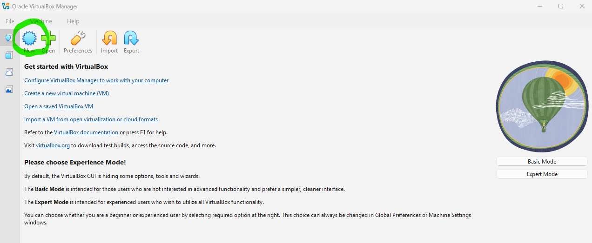  

Seuraavaksi annetaan uudelle VM:lle nimi ja valitaan polku mistä ladattu ISO tiedosto löytyy. Käyttöjärjestelmäksi valittiin Linux, OS distribution: Debian, OS version: Debian(64-bit) ja Proceed with unattended Installation: valitaan uncheck. Kun valitut kohdat ovat oikein, painetaan **Next**   
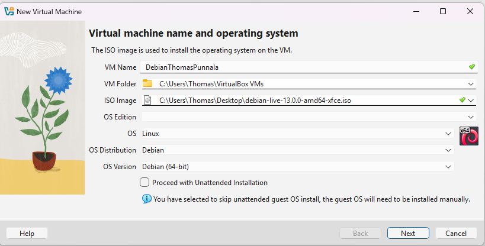   

Base Memory: 4090 MB, Number of CPUs: 2, Disk Size: 50 GB, Use EFI: check ja **Next**.  
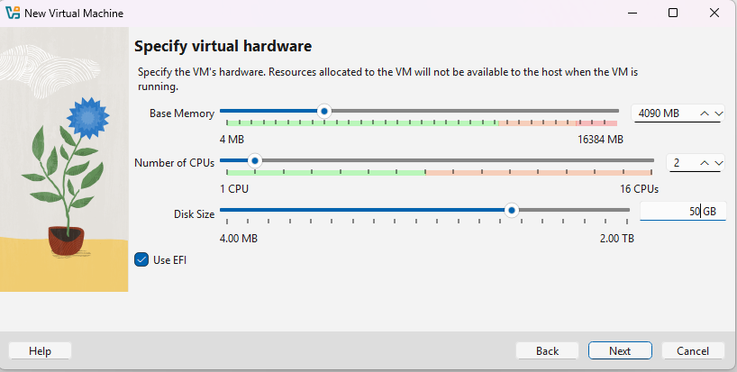  

Tarkistetaan Summary ja painetaan **Finish**  
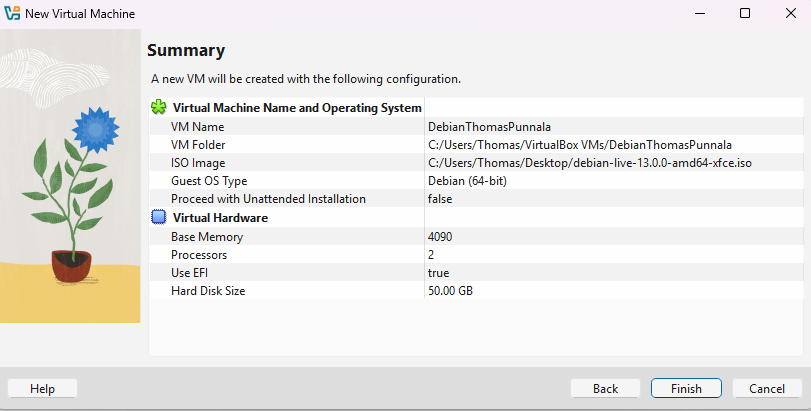   
Huomasin Summarysta, että VM Folder ei ollut halutussa paikassa, joten kävin vaihtamassa sen ennen asennuksen aloittamista, vaihdoin VM Name: Debianthomas, muuten asetukset pitävät paikkansa.  

Seuraavaksi käynnistin VM:n painamalla hiiren oikeaa nappia Debianthomas kohdasta. Tämän jälkeen **Start** -> **Start with GUI**.  
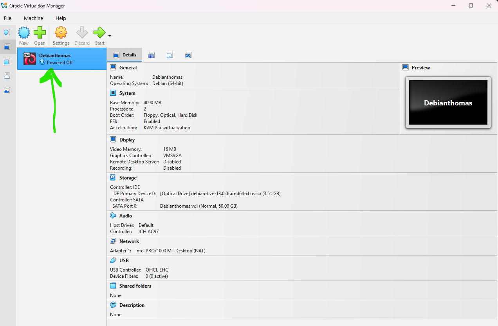  

Sain virheilmoituksen, jonka mukaan VT-x ei ole päällä. Koitin korjata asian käymällä laittamassa sen päälle. VT-x:n päälle laitossa hyödynsin Byte Geek:in youtube-videota aiheesta.  
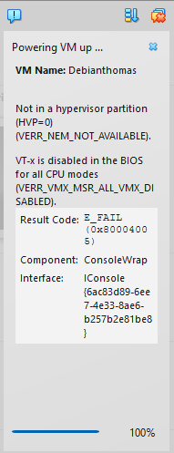  
Asetuksen vaihdon jälkeen VM käynnistyi onnistuneesti.  

Seuraavaksi testataan Debiania ennenkuin asennetaan mitään siihen. Valitaan Live system ja painetaan **Enter**.  
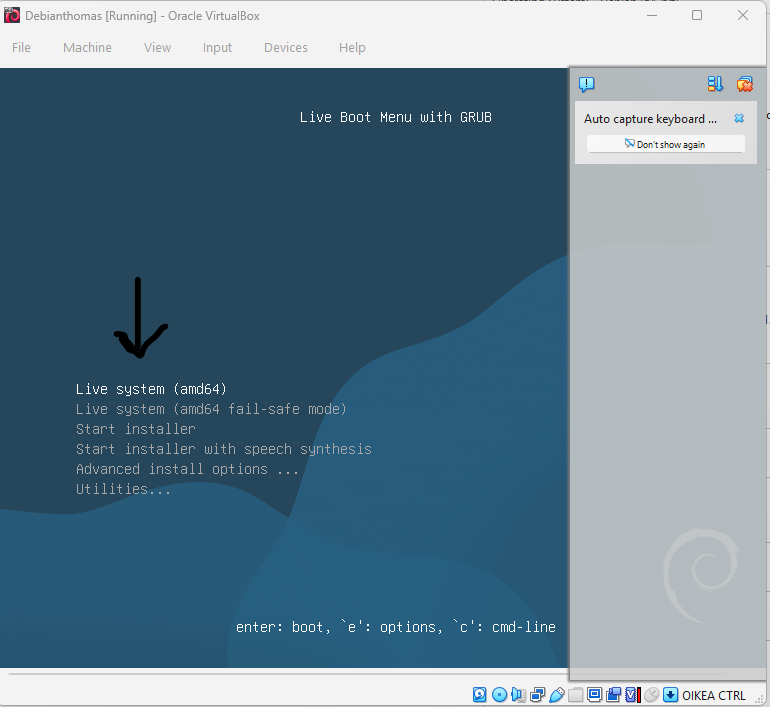  

Testataan ensin internet yhteyden toiminta. Klikataan työpöydällä applications -> web browser -> siirrytään halutulle sivulle.
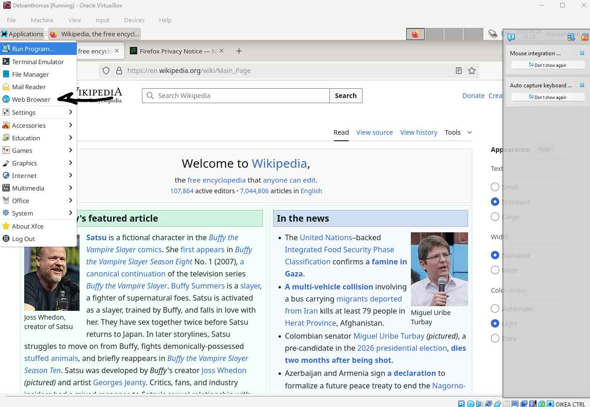  

Testin jälkeen on aika aloittaa itse asennus. Päästäkseni Live Boot Menu:un, avasin Terminal emulatorin ja annoin komennon:
```
sudo reboot
```
Live Boot Menu with GRUB:sta valitaan: Start installer. Seuraavaksi valitaan järjestyksessä:
1. **Kieli**: English
2. **Location**: other
3. **Continent or region**: Europe
4. **Country**: Finland
5. **Configure locales**: en_US.UTF-8
6. **Configure the keyboard**: Finnish
7. Edellä mainittujen jälkeen tulee hieman asennusta, jonka jälkeen jatketaan Configuratioo järjestyksessä
8. **Hostname**: debian
9. **Domain name**: punnala.com
10. **Root password**: jätetään tyhjäksi
11. **Full name for the new user**: thomas punnala
12. **Username for your account**: thomas
13. **Password**: valitaan vahva salasana, jota ei mainita tässä ohjeessa
14. **Partition disks**: Guided - use entire disk
15. **Partition disks**: valitaan ainut vaihtoehto SCI3
16. **Partition disks**: All files in one partition
17. Painetaan valintaa: Finish partitioning and write changes to disk
18. 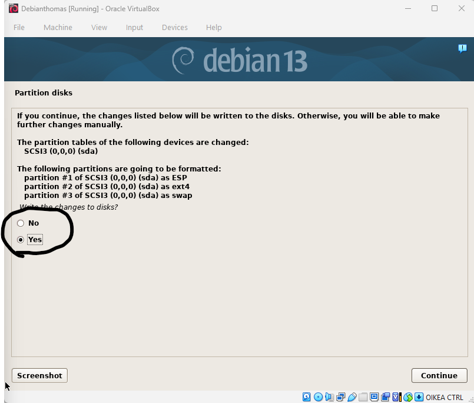 Valitaan **Yes**
19. Tämän jälkeen alkaa asennus, joka kestää hetken
20. Valitaan **Continue**, jolloin järjestelmä käynnistää itsensä uudelleen
21. Uudelleen käynnistyksen jälkeen kirjaudutaan sisään tehdyillä tunnuksilla -> user: thomas -> password: *******

Debian asennettu:  
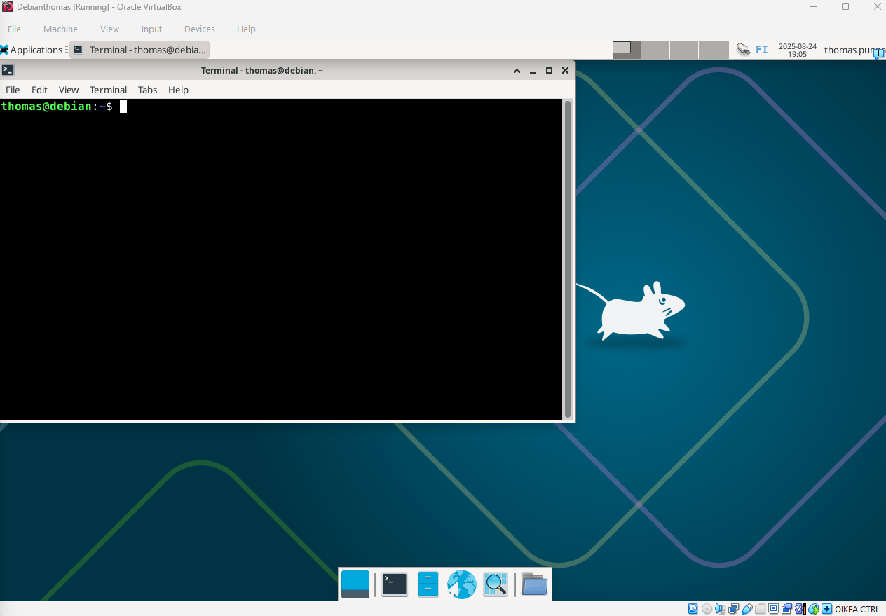

Get update komennon testaus antoi seuraavan virheen:  
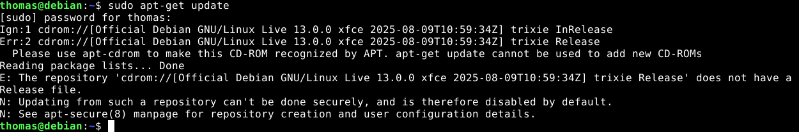  
```
sudo apt-get update
```
Seuraavaan vaiheeseen on käytetty apuna Ksk Royalin youtube-videota, sekä Heinosen ohjeita. Seuraavaksi annoin komennon:
```
sudo nano /etc/apt/sources.list
```
Tämä avasi sources.listin -> sinne laitoin komennot:  
```
deb https://deb.debian.org/debian trixie main non-free-firmware
deb-src https://deb.debian.org/debian trixie main non-free-firmware

deb https://security.debian.org/debian-security trixie-security main non-free-firmware
deb-src https://security.debian.org/debian-security trixie-security main non-free-firmware

deb https://deb.debian.org/debian trixie-updates main non-free-firmware
deb-src https://deb.debian.org/debian trixie-updates main non-free-firmware
```
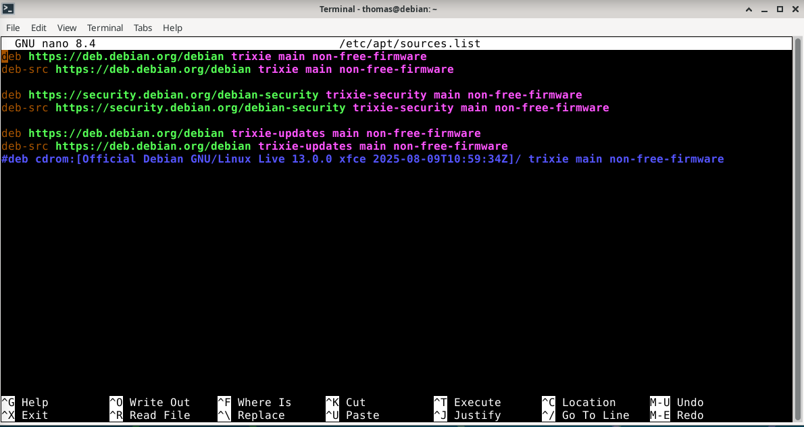
Seuraavaksi Ctrl+O -> Enter -> Ctrl+X(poistumiseen)  
Tämän jälkeen komennot järjestyksessä:  
```
sudo apt-get update
```
```
sudo apt-get -y dist-upgrade
```
```
sudo apt-get -y install ufw
```
```
sudo ufw enable
```
Palomuuri asennettuna:  
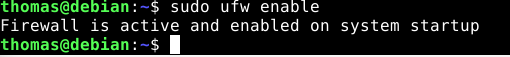  
Tämän jälkeen applications->log out->restart

## VirtualBox Guest Additions asennus
Seuraavaksi asennetaan hieman ominaisuuksia Linuxsiimme, jolloin käyttökokemusta saadaan parannettua.  
Klikataan hiirellä ylhäältä auki **Devices**, ja valitaan **Insert Guest Additions CD image**  
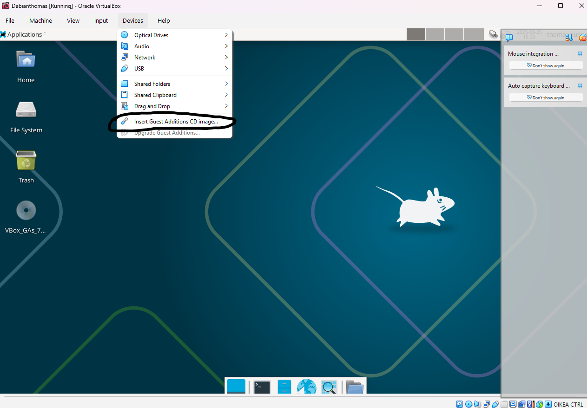  
Tämän jälkeen huomaamme työpöydälle ilmestyneen CD-imagen "VBox_Gas_". Tämän jälkeen klikataan vasemmasta yläkulmasta **Applications** -> **File Manager** -> File manager auki klikataan hiiren vasemmalla napilla CD-iconia alla olevan kuvan mukaisesti.  
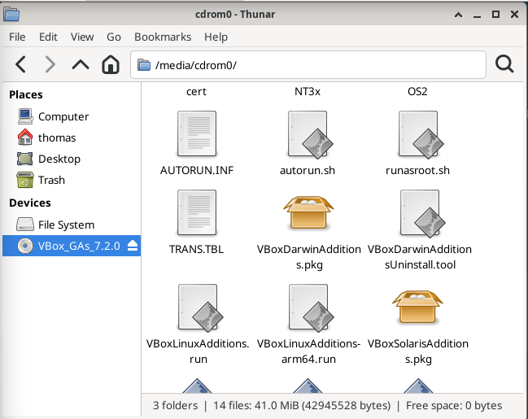  
Tämän jälkeen **Applications** -> **Terminal Emulator** -> Seuraavat komennot terminaaliin järjestyksessä ->  
```
cd /media/cdrom0
```
```
ls
```
```
sudo bash VBoxLinuxAdditions.run
```
Saimme seuraavanlaisen viestin terminaaliin.  
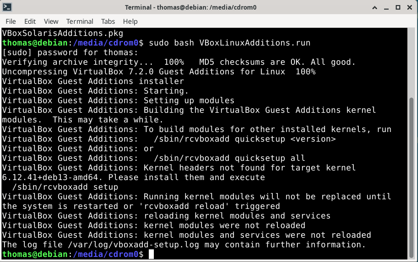  
Käynnistetään järjestelmä uudelleen ja katsotaan mitä käy.  
Uudelleen käynnistyksen jälkeen COPY PASTEN saa toimimaan seuraavalla tavalla -> **Devices** -> **Shared Clipboard** -> Valitaan **Bidirectional**.  
Resoluutiossa en ole varma huomasinko isoa eroa, mutta oletan että asennus onnistui, koska copy paste toimii.


## Lähteet
ByteGeek 2025. Enable Virtualization (Intel VT-x) to Fix VMware Errors. Katsottavissa: https://www.youtube.com/watch?v=3PhNDH_pQDk. Katsottu: 24.8.2025  

Heinonen, J. 2025. Johanna-test-repo. linux-20082025.md. Luettavissa: https://github.com/johannaheinonen/johanna-test-repo/blob/main/linux-20082025.md. Luettu: 24.8.2025  

Karvinen, T. 2006. Raportin kirjoittaminen. Luettavissa: https://terokarvinen.com/2006/raportin-kirjoittaminen-4/. Luettu: 24.8.2025  

Karvinen, T. 2021. install debian on virtual box. Luettavissa: https://terokarvinen.com/2021/install-debian-on-virtualbox/. Luettu: 24.8.2025  

Karvinen, T. 2023. dreamhugmonkey. Luettavissa: https://github.com/terokarvinen/dreamhugmonkey. Luettu: 24.8.2025  

Karvinen, T. 2025. Linux Palvelimet 2025 alkusyksy: läksyt. Luettavissa: https://terokarvinen.com/linux-palvelimet/. Luettu: 24.8.2025  

KskRoyal. 2025. 10 Things To Do After Installing Debian 13 (TRIXIE). Katsottavissa: https://www.youtube.com/watch?v=qmRq1U9Sz14&t=180s. Katsottu: 24.8.2025  

Markdown Guide. Basic Syntax. Luettavissa: https://www.markdownguide.org/basic-syntax/. Luettu: 24.8.2025  

SethClydesdale 2019. Luettavissa: https://github.com/orgs/community/discussions/22534. Luettu: 24.8.2025  
