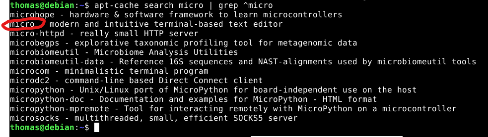

Tunnin 2 vinkit:  
man man = manuaali
komento --help = komennon avut  
kaks kertaa tabulator niin näkee mitä mahdollisia komentoja on  
tree = näyttää linuxin hakemistorakenteen  
etc on tärkeä hakemisto, löytyy paljon configuraatiofileja. etc vaatii ROOT oikeudet eli täytyy käyttää sudo komentoa.  
huom linuxissa jos poistat tai ylikirjoitat jotain, niin se on sitten tehty, eli ei ole palautusta niinkun Windowsissa. Eli tee mitä tiedät tekeväsi.  
.. menee pykälän eteenpäin hakemistossa  
cd = pääsee takas kotihakemistoon  
Editorit esim: nano, micro, 
uuden tiedoston luonti: nano uusi.txt  
touch testihakemisto/alihakemisto/(filename) = uusi tiedosto absoluuttista polkua käyttämällä  


update: 28.8.2025  
# Tietokone ja käyttöjärjestelmä
**GPU:** Nvidia RTX 2070  
**Processor:** Intel Core i9-9900K 3.60 Ghz    
**RAM:** 16.0 GB  
**OS:**  Windows 11 Home  

# Komentorivin käyttö

## Tiivistelmä
**28.8.25**  
**Aloitusaika**: 16:26  
**Lopetusaika**: 20:00   
 
Tämän harjoituksen tavoitteet löytyvät Tero Karvisen Linux Palvelimet 2025 alkusyksyn web sivulta kohdasta h2 Komentaja pingviini (Karvinen 2025).  

## Komennot  
Komentorivi on tosiaan kestänyt aikaa erittäin hyvin. Sitä käytettiin ennen Linuxin, Windowsin ja internetin aikaa ja sitä käytetään edelleen (Karvinen 2025). Komentorivi harjaantuneissa käsissä on erittäin nopeaa verrattuna esimerkiksi graafiseen käyttöliittymään. Komentorivi on myös kevyt raudalle, se ei vaadi suurta määrää tehoa pyöriäkseen. Tästä johtuen se on suosittu esimerkiksi servereiden käyttöön. Komentorivin avulla vaikeidenkin tehtävien tekeminen onnistuu muutamalla komennolla ja se on erittäin automaatio ystävällinen. (Walkme 2025)  

Tässä listattuna Linuxin komentorivin peruskomentoja (huom. $-merkki on normaali käyttäjäprompti ja sitä ei tarvitse kirjoittaa mukaan):  
`$ pwd` Näyttää tämän hetkisen työhakemiston  
`$ ls` Listaa tiedostot tämän hetkisessä hakemistossa  
`$ cd Desktop/` cd:n avulla voidaan liikkua hakemistossa, esim. mainittu komento siirtäisi käyttäjän työpöydän directoryyn  
`$ cd ..` tuplapisteellä voidaan siirtyä hakemistossa yhdenpykälän ylöspäin hakemistohierarkiassa  
Koin itse, että nämä komennot yhdistettynä `$ tree` -komentoon (näyttää hakemiston puumaisena rakenteena) ovat hyvä tapa opetella siirtymään hakemistossa. `$ tree` luo visuaalisen kartan, joka helpottaa navigointia ja rakenteen hahmottamista.  
`$ less` Tämä komento avaa tulosteen tai teksitiedoston helpommin selattavassa muodossa. Käyttäjä pystyy liikkumaan esimerkiksi helposti ylös ja alas lukiessaan tulostetta. `$ less` komennon jälkeen voimme käyttää `?` -merkkiä ja hakea jotain tiettyä patternia tekstistä. Kun haluamme poistua tästä lukutilasta painamme näppäimmistöllä `q` -merkkiä.  
Helpoin tapa palauttaa itseni kotihakemistoon oli komennolla `$ cd`, tätä voidaan käyttää hyödyksi tilanteessa, jossa käyttäjä eksyy hakemistoon ja haluaa aloittaa alusta.  
En luettele kaikkia opeteltuja peruskomentoja, mutta saadaksenne käsityksen mihin kaikkeen komentoriviä voi käyttää aion luetella muutaman esimerkin. 

Tiedostojen käsittely. Voimme luoda ja muokata tiedostoja editoreilla, kuten nano ja pico. Jos tiedostoa ei ole vielä olemassa, se luodaan editorin avauksen yhteydessä.  

SSH eli secure shell etäyhteys. Voidaan avata suojattu etäyhteys vaikkapa serveriin.  

Historian tarkasteluun.  

Tämänhetkinen suosikki ominaisuuteni on `tree`n lisäksi `Tab`:n eli tabulaattorin käyttö. Kun alkaa kirjoittamaan komentoa, tabulaattori näyttää mahdolliset vaihtoehdot kirjoitettujen kirjaimien perusteella. Jos vaihtoehtoja on vain yksi, kaksoispainallus täydentää komennon automaattisesti loppuun. Tämä on erityisen hyödyllinen, kun kirjoitetaan tiedostojen nimiä, sillä näin vältetään mahdolliset kirjoitusvirheet.  

Admin komennot. Kun halutaan antaa komentoja jotka vaikuttavat koko järjestelmään, täytyy antaa `$ sudo` -komento. Tämä etuliite antaa rajoittamattomat oikeudet. Tätä voidaan hyödyntää esimerkiksi ohjelmistojen asentamiseen ja poistamiseen. (Karvinen 2020) Heinosen mukaan jos joudutaan antamaan `sudo` -komento, tulisi miettiä tarkkaan mitä on tekemässä. Linux tekee juuri niinkuin sitä käsketään ja esimerkiksi poistettujen tiedostojen palautus muuttuu mahdottomaksi (27.8. Linux-palvelimet oppitunti).  

Lisää vinkkejä komentorivin käyttöön:  
Näppäimmistön nuoli ylöspäin painettuna palauttaa edellisen komennon. Erityisen hyödyllinen kun on tehnyt kirjoitusvirheen ja haluaa korjata jonkin tietyn komennosta.  
`clear` tyhjentää komentorivin tekstistä.  
`sudo apt remove [ohjelma]` Poistaa ohjelman asennuksen  


## Micro-editorin asennus
Lähdetään asentamaan Micro-editoria. Ensin on hyvä avata virtuaalikone ja kirjautua tunnuksilla sisään. Tämän jälkeen avataan terminaali.  
Annetaan komento ```apt-cache search micro | grep ^micro```. Voidaan todeta, että terminal-based text editor on nimeltään `micro`.  
Tämän jälkeen voidaan antaa komento `sudo apt-get install micro`, joka asentaa kyseisin ohjelman Linuxillemme. Tässä huomataankin, että kun asennetaan ohjelmia täytyy antaa `sudo` -komento aluksi. Sudon käyttö vaatii salasanan toimiakseen, tämän pitäisi viimeistään herätellä ajatuksia ollaanko tekemässä varmasti sitä mitä halutaan.  
  
Valitaan `y`. Nyt asennettu micro-editor voidaan avata kirjoittamalla `micro` komentoriville. Tämä komento avaa editorin.  
Painamalla näppäinyhdistelmää CTRL + `g` saadaan käyttöohjeet auki. CTRL + q:n avulla päästään pois editorista, editori kysyy vielä tässä kohtaa halutaanko tallentaa. Kirjoitin editoriin `hello world` ja painoin CTRL + q. Koska tiedostoa ei ollut vielä olemassa sain vielä option nimetä sen. Käytin nimeä `hei_maailma`. Tämän jälkeen kävin katsomassa mitä tallensin ja mihin. Kirjoittamalla komennon `tree` huomasin tehneeni uuden directoryn kotihakemistooni, tottakai koska siellä olin, kun loin tiedostoa.   
 
  
Ja näin on asennettu Micro-editor.  
(Heinonen 2025)  
## Apt
Aloitin komentoriviohjelmia etsimisen googlesta. Käytin promptia `commandline programs for linux` ja etsin mielestäni mielenkiintoisimmat ohjelmat. Kaikki ohjelmat saadaan asennettua yhdellä kertaa komennolla `sudo apt-get install thefuck ncdu cowsay`  
### thefuck
Ohjelman asennuksen jälkeen piti asentaa alias kytkentä komennolla `eval $(thefuck --alias)`. Ohjeessa suositeltiin asentamaan se shell-profiiliin. Tämä on itselleni vielä vieras aihe, joten pitäydyin yksinkertaisessa versiossa (nvbn, thefuck).  

Tämä ohjelma korjaa väärin kirjoitetut komennot. Esimerkiksi halusin siirtyä työpöydälle komennolla `cs Desktop/`, joka antoi virheen `bash: cs: command not found`. Nyt voin kirjoittaa komentoriville `fuck` ja se antaa ehdotuksen todennäköisestä komennosta mitä halusin käyttää, tämän jälkeen painan Entteriä ja oikea komento ajetaan.  
  

## ncdu
Tätä ohjelmaa voidaan käyttää levytilan tarkasteluun. Näyttää suoraan mitkä kansiot ja tiedostot vievät eniten tilaa. Pystyn poistamaan ohjelman kautta turhat hakemistot ja tiedostot. (Brock, W. 2024)  

  

## cowsay
Tämä ohjelma piirtää komentoriville lehmän, joka sanoo käyttäjän haluaman merkkijonon. Esimerkiksi ´cowsay hei maailma!` tulostaa seuraavanlaisen kuvan:  
   

## FHS
**/** Root directory. Siirryin root directoryyn komennolla `cd /` ja listasin tiedostot ja hakemistot komennolla `ls`. Tärkeitä kansioita ovat esimerkiksi bin/ (sisältää tärkeitä ohjelmia), etc/ (järjestelmän asetukset), home/ (käyttäjien kotihakemistot) ja var/ (lokit, paketinhallinnan välimuistit).  
  

**/home/** Kaikkien käyttäjien kotihakemistot. Itselläni näkyy vain kansio `thomas`. `ls -la` komennolla voidaan huomata myös omistajuus (thomas thomas).  
  

**/home/thomas/** Tämä on käyttäjän oma hakemisto. Täältä löytyy esimerkiksi käyttäjän omat hakemistot, kuten Desktop ja Documents. Hakemistossa näkyy myös itse tekemäni hei_maailma tiedosto. Documents kansio ei sisällä vielä tiedostoja.   
  
  
  
`cat hei_maailma` näytti mitä tiedosti pitää sisällään.  
  
Tästä näemme, että olen aiemmin päivittänyt järjestelmän pakettiluettelon.  

**/etc/** Täältä löytyy järjestelmän konfiguraatiot ja asetukset.  
  
Kuvassa tulostettu hostname, tietoja käyttöjärjestelmästä, sekä käyttäjien perustiedot.  
  
  


## Grep-komennon käyttö, sekä esimerkki Pipen käytöstä
`grep` -komennon avulla voidaan etsiä esimerkiksi tiettyjä sanoja tekstistä. Esimerkiksi kun halutaan asentaa jokin ohjelma, voidaan ensin etsiä komennolla `apt-cache search [paketin nimi]` pakettitietoja. Käytin tätä Micro-editorin asennuksen etsimisessä. Pelkästään `apt-cache search micro` antoi erittäin suuren määrän paketteja komentoriville.  
  
Seuraavaksi etsitään tekstistä kaikki mitkä alkavat sanalla micro. `^` -merkki osoittaa millä sanan kuuluu alkaa, eli voidaan käyttää komentoa `apt-cache search micro | grep ^micro`. Jolloin tulos on jo paljon luettavampi.  
  
Tässä hyödynnettiin `grep`:in lisäksi Pipea. Eli sen sijaan, että tulostan omalle ruudulleni kaiken, annan sen grep-komennolle, joka suodattaa haluamani lopputuloksen. (Heinonen 2025)  

## Lähteet
Brock, W. 2024. Disk usage with the ncdu Linux command. Katsottavissa: https://www.youtube.com/watch?v=Lt7QzoY7NiE. Katsottu: 28.8.2025  
Heinonen, J. 2025. linux-27082925.md. johanna-test-repo. Luettavissa: https://github.com/johannaheinonen/johanna-test-repo/blob/main/linux-27082925.md. Luettu: 28.8.2025  
Karvinen, T. 2025. Linux Palvelimet 2025 alkusyksy. Luettavissa: https://terokarvinen.com/linux-palvelimet/. Luettu: 28.8.2025  
Karvinen, T. 2020. Command Line Basics Revisited. Luettavissa: https://terokarvinen.com/2020/command-line-basics-revisited/?fromSearch=command%20line%20basics%20revisited. Luettu: 28.8.2025
nvbn. thefuck. repisotory. Luettavissa: https://github.com/nvbn/thefuck. Luettu: 28.8.2025  
WalkMeTeam. 2025. Graphical user interface (GUI) vs command line interface (CLI). Blogi-kirjoitus. Luettavissa: https://www.walkme.com/blog/graphical-user-interface-vs-command-line-interface/. Luettu: 28.8.2025  
Heinonen, J. 2025. Linux-palvelimet oppitunti. Kuunneltu: 27.8.2025  

