kolmas tehtävä:  
pitäisi katsoa uudelleen käynnistyksen yhteydessä käynnistyykö apache automaattisesti sudo systemctl is-enabled apache2  
documentRoot on se mistä apache tietää että siellä on se varsinainen kontentti  
sites-available kaikki  
sites-enable on ne mitkä on käytössä  
enable kansiossa olevat tiedostot ovat linkki available tiedostossa oleviin tietoihin  
kaikki omat sivut tehdään käyttäjän kotihakemistoon, eli ei tarvita sudo komentoa muokkaukseen  
sudo journalctl näyttää apache tason logit  


usean webbisivun ajaminen saman ip:n alla:  
/etc/hosts fileen täytyy käydä laittamassa webbisivu esim 127.0.0.1 site2.com  
näin saadaan kerrottua nimipalvelulle, että minkä ip:n takaa löytyy webbisivu kirjoitettuna selkokielisenä  

update: 6.9.2025  
# Tietokone ja käyttöjärjestelmä
**GPU:** Nvidia RTX 2070  
**Processor:** Intel Core i9-9900K 3.60 Ghz    
**RAM:** 16.0 GB  
**OS:**  Windows 11 Home  

# Hello Web Server

## Tiivistelmä
**6.9.25**  
**Aloitusaika**: 16:48  
**Lopetusaika**:   
  
Tämän harjoituksen tavoitteet löytyvät Tero Karvisen Linux Palvelimet 2025 alkusyksyn web sivulta kohdasta h3 Hello Web Server (Karvinen 2025).  

## Name-based Virtual Hosts

Apache tukee useaa domain-nimeä yhden IP-osoitteen alla (Karvinen 2018). Tämä tapa säästää IP-osoitteita, koska useita eri host-nimiä voidaan palvella saman osoitteen alla. Tämä on toteutettu sisällyttämällä HTTP-otsakkeeseen hostname. (Apache)  
Apache Web Server asennetaan antamalla komento `sudo apt-get -y install apache2`, voimme myös muokata default web sitea esimerkiksi antamalla seuraava komento `echo "<tähän voi kirjoittaa mitä haluaa sivulla näkyvän>"|sudo tee /var/www/html/index.html`. Saadaksemme uusi nimi-pohjainen virtuaalipalvelin toimintaan, on sille annettava määrityksiä. Luodaan aluksi uusi konfiguraatio tiedosto komennolla `sudoedit /etc/apache2/sites-available/pyora.example.com.conf` ja annetaan sille seuraavanlainen sisältö:
```
<VirtualHost *:80>
 ServerName pyora.example.com
 ServerAlias www.pyora.example.com
 DocumentRoot /home/xubuntu/publicsites/pyora.example.com
 <Directory /home/xubuntu/publicsites/pyora.example.com>
   Require all granted
 </Directory>
</VirtualHost>
```
Sivun osoitteeksi tulee siis pyora.example.com, jolla on myös www. alkuinen alias, eli vaihtoehtoinen nimi osoitteelle. DocumentRoot kertoo kansion, mistä sivuston tiedot löydetään. <Directory> antaa lukuoikeuden kaikille sivuston kansioon. (Karvinen 2018)  
Tämän jälkeen enabloidaan sivusto antamalla komento `sudo a2ensite pyora.example.com` ja uudelleen ladataan Apachen konfiguraatio tiedostot ilman palvelun uudelleen käynnistystä komennolla `sudo systemctl reload apache2` (Heinonen 2025).  
Tämän jälkeen voimme luoda uuden web-sivun normaalina käyttäjänä, käyttäjän kotihakemistoon, `mkdir -p /home/xubuntu/publicsites/pyora.example.com/` ja index.html tiedosto komennolla `echo pyora > /home/xubuntu/publicsites/pyora.example.com/index.html`. Web-sivu sisältäisi tällä hetkellä tiedon "pyora". Tämän jälkeen voimme testata sivua komentorivillä antamalla curl komennon `curl pyora.example.com`. Koska emme ole vielä vuokranneet nimeä palveluntarjoajalta, voimme simuloida nimipalvelua lokaalisti. Teemme sen muokkaamalla /etc/hosts tiedostoon IP-osoitteen joka vastaa pyora.example.com nimeä. (Karvinen 2018)  
On erittäin suositeltavaa määrittää Servername aina jokaiselle virtuaalipalvelimelle, muuten Apache joutuu käyttämään järjestelmän isäntänimeä (FQDN). Jos yksikään ServerName tai Alias ei vastaa pyyntöön, palvelin käyttää ensimmäistä konfiguraatiossa määritettyä virtuaalipalvelinta IP:lle ja portille. (Apache)  

## Tehtävät

Tehtävien tekeminen aloitetaan normaalisti avaamalla virtuaalikone, kirjautumalla sisään ja avaamalla Terminal-sovellus. Apachen weppipalvelin oli asennettu oppitunnilla, joten asennusta ei käydä tässä raportissa sen enempää läpi. Raporttia varten testaan kuitenkin onko Apache statuksen komennolla `sudo systemctl status apache2`, kuten voimme huomata Apache2 on päällä ja enabloitu. Voimme huomata lokiviesteistä varoituksen: Sep 06 15:55:05 debian apachectl[1073]: AH00558: apache2: Could not reliably determine the server's fully qualified domain na>, eli ServerNamea ei ole asetettu. En lähde korjaamaan asiaa tässä kohtaa. (Heinonen 2025)    

  

Seuraavaksi testasin että weppipalvelin vastaa localhost-osoitteesta. Annoin komennon `curl localhost` ja komentoriville ilmestyi html muodossa oleva esimerkkisivusto. (Karvinen 2018)  

  

Seuraavaksi oli tarkoitus etsiä ja analysoida lokeista rivit, jotka syntyvät kun omalta palvelimelta ladataan sivu. Heinosen ohjeista löysin komennon `sudo tail -f /var/log/apache2/access.log`. Komennon jälkeen loki-tekstit ilmestyivät komentoriville, käytin näppäimmistön ENTER näppäintä hyödyksi, jotta sain hieman tyhjää tilaa aikaisempien lokitekstien ja uuden kohta ilmestyvän tekstin väliin. Tämän jälkeen avasin uuden Terminal sovelluksen ja kirjoitin komennon `curl localhost`. Komennon jälkeen huomasin että alkuperäiseen lokitekstiin ilmestyi uusi log entry. (Heinonen 2025)  

  

### lokin analyysi
Analyysiin on käytetty hyödyksi David Girvinin (2025) blogi-tekstiä "Understanding the Apache access log: how to view, locate, and analyze".  
::1 - - [06/Sep/2025:17:07:16 +0300] "GET / HTTP/1.1" 200 10981 "-" "curl/8.14.1"  

1. ::1 = IP-osoite joka teki pyynnön, eli tässä tilanteessa se on loopback-osoite, joka tarkoittaa pyynnön tulleen itseltään
2. [06/Sep/2025:17:07:16 +0300] = päivämäärä ja aika kun pyyntö tehtiin
3. GET = pyynnön metodi, eli resurssi haetaan
4. HTTP/1.1 = HTTP-protokollan versio. Tässä tilanteessa 1.1
5. 200 = HTTP status code. Tässä tilanteessa onnistunut vastaus (MDN 2025)
6. 10981 = palvelimen palauttaman vastauksen koko
7. "-" = mistä sivulta käyttäjä tuli. Tässä kohtaa ei ole mitään, koska pyyntö tuli curlilla
8. curl/8.14.1 = pyyntö tehtiin curl-työkalulla, jonka versio on 8.14.1

### Etusivu uusiksi

Aloitin tekemisen siirtymällä /etc/ kansioon komennolla `cd /etc/` lähdin etsimään sieltä hosts tiedostoa komennolla `ls | grep ^hosts`. Koska oikeata DNS:ssää ei ole käytössä, voimme simuloida sitä hosts-tiedostossa. Avasin tiedoston komennolla `micro hosts`, jonka jälkeen muokkasin tiedostoon sivun hattu.example.comin osoittamaan IP-osoitteeseen 127.0.0.1, lisäsin myös valmiiksi aliaksen osoitteen oikein. Tallennuksen yhteydessä jouduin antamaan sudo-salasanan. (Heinonen 2025)    

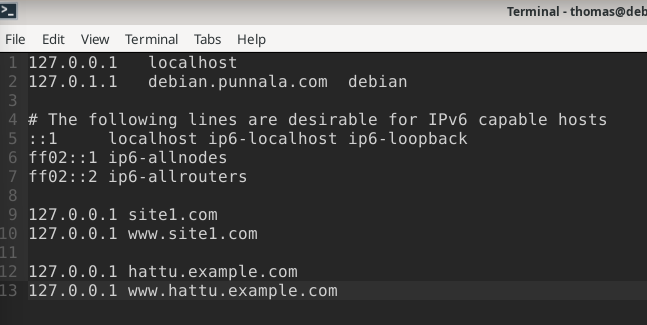  

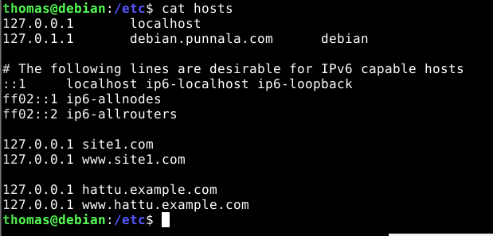  

Seuraavaksi luodaan uusi virtual hosti osoitteelle hattu.example.com. Luodaan uusi konfiguraatio tiedosto polkuun /etc/apache2/sites-available/. Voimme käyttää tässä suoraan komentoa `sudoedit /etc/apache2/sites-available/hattu.example.com.conf`, jolloin tiedosto luodaan suoraan sinne. Tiedostolle annetaan seuraavanlainen sisältö:  

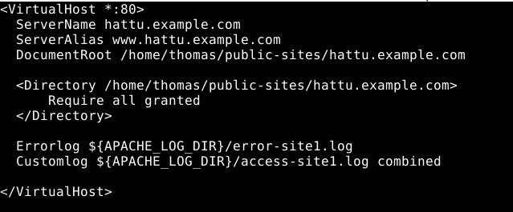  

Tallennetaan näppäinyhdistelmällä CTRL + x -> y -> ENTER.  

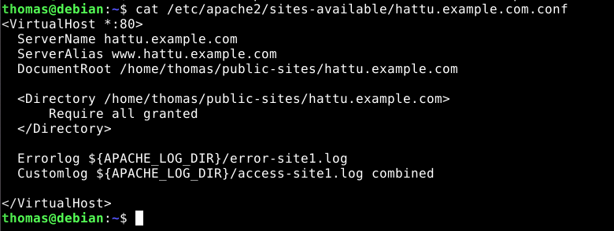  

Haluamme muokata sivua normaalina käyttäjänä ilman sudo oikeuksia, jolloin laitamme weppisivun sisällön käyttäjän kotihakemistoon /home/thomas/public-sites/hattu.example.com. Aloitetaan luomalla hattu kansio tuohon polkuun komennolla `mkdir -p /home/thomas/public-sites/hattu.example.com/`. Liikuin hattu kansioon komennolla `cd public-sites/hattu.example.com/`. Tämän jälkeen loin kansioon uuden tiedoston nimeltä idex.html, joka tulee sisältämään weppisivun sisällön.  
Luodaan index.html komennolla micro index.html ja laitetaan sisältöä sinne. Tiedosto avautui micro-editoriin ja tässä kohtaa siirryin Karvisen (2012) lyhyt HTML5 page ohjeeseen. Kopioin ohjeesta HTML koodin ja lisäsin sen auki olevaan micro-editoriin. Muokkasin sisältöä sopimaan omaan työhöni.  

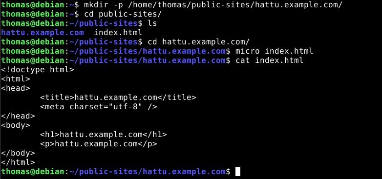  

Seuraavaksi otin oppitunnilla asetetun weppisivun pois päältä komennolla `sudo a2dissite site1.com.conf` ja tämän jälkeen komento `sudo systemctl reload apache2`. (Heinonen 2025) Koitin `curl site1.com` ja huomasin, että se on kytketty pois päältä, koska komento avasi Apachen default pagen.  
Seuraavaksi laitoin hattu sivun päälle komennoilla `sudo a2ensite hattu.example.com.conf` ja `sudo systemctl reload apache2`. (Heinonen 2025)  
Nyt on hyvä kohta testata toimiiko uusi sivu curl komennolla. Eli `curl hattu.example.com`, sekä alias `curl www.hattu.example.com`

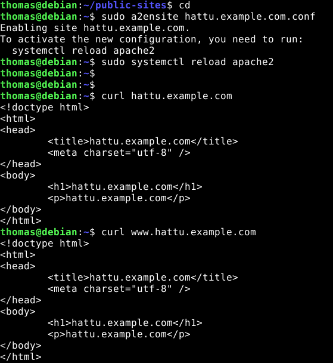  

Toimii! Tässä kohtaa muistin, että sivuston piti näkyä suoraan palvelimen etusivulla, eli localhost. Tämä ei toiminut, vaan sivulle avautui apachen default sivu. Hetken Heinosen ja Karvisen ohjeista tutkiskellessa muokkasin hattu.example.com.conf tiedoston ServerAlias kohtaan localhost. Reloadasin apachen ja nyt sivu vastaa localhost pyyntöön.  

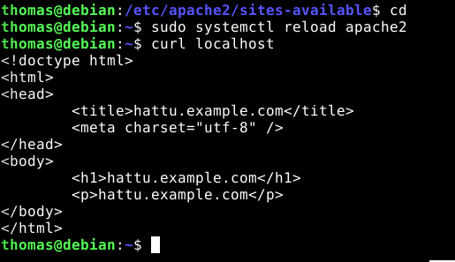  

### Curl

`curl hattu.example.com` hakee HTML kontentin ja näyttää sen terminaalissa. Tässä haetaan siis koko sivu (GET):llä. Tätä komentoa on käytetty usean kerran tämän raportin aikana. (geeksforgeeks)   

`curl -I hattu.example.com` hakee vain otsakkeen ja jättää bodyn pois.  

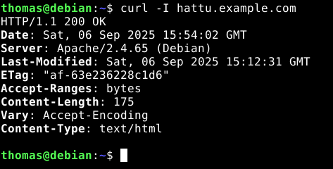  

1. HTTP/1.1 200 OK = pyyntö onnistunut
2. Date: Sat, 06 Sep 2025 15:54:02 GMT = aika jolloin vastaus muodostettiin
3. Server: Apache/2.4.65 (Debian) = palvelinohjelmisto ja versio
4. Last-Modified: Sat, 06 Sep 2025 15:12:31 GMT = aika on outo, koska en ole ollut tuohon aikaan tekemässä mitään tälle.
5. Content-Length: 175 = kontentin koko
6. Content-Type: text/html = sisällön tyyppi eli html

`curl I` -komentoa voidaan käyttää esimerkiksi debuggaukseen, HTTP vastauksen ymmärtämiseen ja turvallisuustarkastuksiin. (Apidog 2024)  

### Kaksi sivustoa

Suoritan vapaaehtoisen tehtävän tekemällä vielä yhden uuden sivuston huivi.example.com, jonka jälkeen samalla koneella on kaksi weppisivua: hattu.example.com ja huivi.example.com.  
Aloitin muokkaamlla hosts tiedostoa polussa /etc/hosts. Lisäsin tähän tiedostoon huivi.example.comin tiedot.  

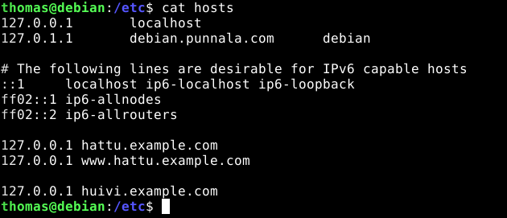  

Tämän jälkeen siirryin /etc/apache2/sites-available ja loin uuden tiedoston komennolla `micro huivi.example.com`. Laitoin tiedostoon seuraavat tiedot.  

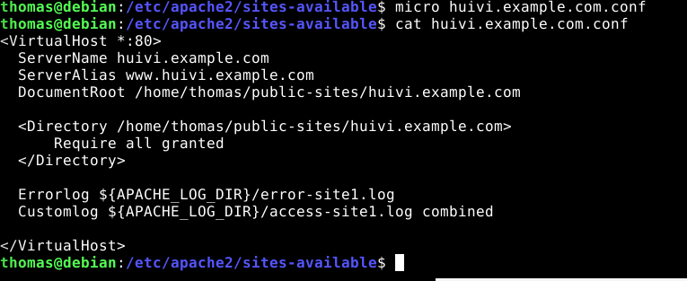  

Seuraavaksi loin uuden kansion polkuun /home/thomas/public-sites/huivi.example.com. Uuteen kansioon tein index.html tiedoston, jolle annoin seuraavan sisällön.  

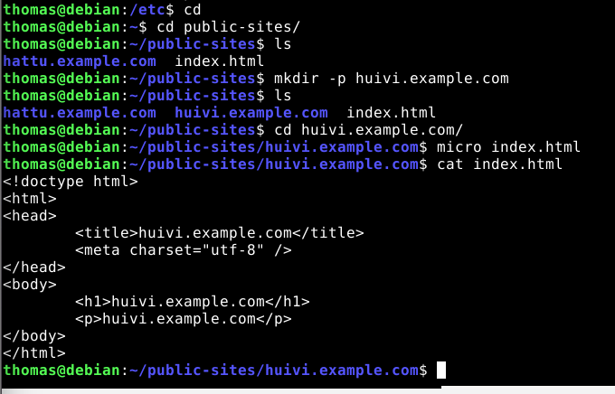  

Sitten sivusto päälle komennoilla `sudo a2ensite huivi.example.com.conf` ja `sudo systemctl reload apache2`.  
Tässä sivustot selaimessa.  

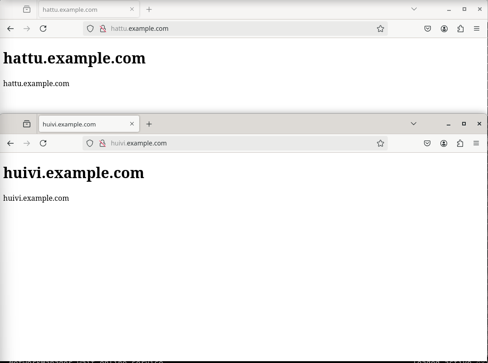


## Lähteet

Apache. Name-based Virtual Host Support. Luettavissa: https://httpd.apache.org/docs/2.4/vhosts/name-based.html. Luettu: 6.9.2025  

Apidog. 2024. Curl -i Command. Luettavissa: https://apidog.com/articles/curl-i-command/. Luettu: 6.9.2025  

GeeksforGeeks. 2025. curl Command in Linux with Examples. Luettavissa: https://www.geeksforgeeks.org/linux-unix/curl-command-in-linux-with-examples/. Luettu: 6.9.2025  

Girvin, D. 2025. Understanding the Apache access log: how to view, locate, and analyze. Sumo logic. Luettavissa: https://www.sumologic.com/blog/apache-access-log. Luettu: 6.9.2025  

Karvinen, T. 2025. Linux-palvelimet. Luettavissa: https://terokarvinen.com/linux-palvelimet/. Luettu: 6.9.2025  

Karvinen, T. 2018. Name Based Virtual Hosts on Apache – Multiple Websites to Single IP Address. Luettavissa: https://terokarvinen.com/2018/04/10/name-based-virtual-hosts-on-apache-multiple-websites-to-single-ip-address/. Luettu: 6.9.2025  

Karvinen, T. 2012. Short HTML5 page. Luettavissa: https://terokarvinen.com/2012/short-html5-page/. Luettu: 6.9.2025

MDN. 2025. HTTP response status codes. Luettavissa: https://developer.mozilla.org/en-US/docs/Web/HTTP/Reference/Status. Luettu: 6.9.2025  

Heinonen, J. 2025. linux-03092025.md. Luettavissa: https://github.com/johannaheinonen/johanna-test-repo/blob/main/linux-03092025.md. Luettu: 6.9.2025  


