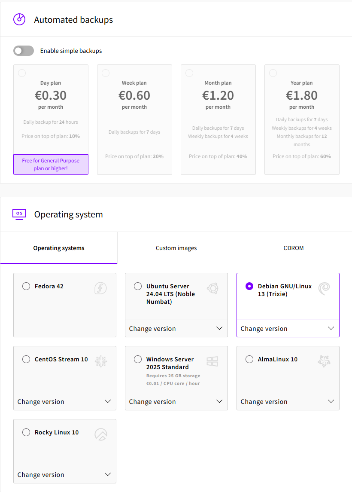
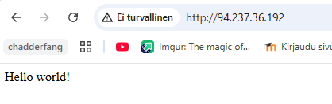

update: 6.9.2025  

# Lokaali tietokone ja käyttöjärjestelmä
**GPU:** Nvidia RTX 2070  
**Processor:** Intel Core i9-9900K 3.60 Ghz    
**RAM:** 16.0 GB  
**OS:**  Windows 11 Home  

# Virtuaali palvelin

**Template:** Debian GNU/Linux 13 (Trixie)  
**CPU:** 1 core  
**RAM:** 1 GB  
**Storage:** 10 GB
**Service provider:** UpCloud  

# Hello World

## Tiivistelmä
**11.9.25**  
**Aloitusaika**: 15:00  
**Lopetusaika**: 18:00   
  
Tämän harjoituksen tavoitteet löytyvät Tero Karvisen Linux Palvelimet 2025 alkusyksyn web sivulta kohdasta h4 Maailma kuulee (Karvinen 2025). Olin tehnyt kaikki tarvittavat asennukset jo oppitunnin aikana. Avasin siis uuden serverin **UpCloudista**, jotta tässä raportissa olisi järkevä sisältö. Tämä raportti on kirjoitettu erityisesti itselleni voidakseni palata aiheen pariin, kun toimenpiteet eivät ole tuoreessa muistissa.  

Tätä raporttia lukiessa on hyvä huomioida, että UpCloudin käyttöliittymä saattaa muuttua aikaajoin, jolloin kaikki ohjeet eivät ole täsmällisiä, juuri lukijan kohdalla, perusidea kuitenkin säilyy.  

Tämän raportin aikana asennettu palvelin oli yllättävän suoraviivaista tehdä. Käytin tässä enemmän Karvisen (2017) ohjeiden komentoja hyödyksi. Tunnilla säädimme samoja asetuksia tiedostoista. Vaihdoin takaisin tunnilla tehtyyn palvelimeen kohdassa **name based virtual host** ja poistin tässä raportissa asennetun palvelimen.  

Onnistuin mielestäni kaikissa tehtävän tavoitteissa hyvin. Oli hyvä päätös rakentaa palvelin ilman suoraviivaista ohjausta, kuten Karvinen (2025) oppitunnilla mainitsikin, nämä asiat oppii parhaiten toistamalla tekemistä.  


## Pois pöytälaatikosta

**Pilvipalvelimen vuokraus ja asennus**:  
Pilvipalvelun vuokraamiseen on monia eri palveluntarjoajia. Jokainen, joka aikoo vuokrata tämänkaltaisen palvelun tuleekin harkita tarkkaan mihin käyttöön tarvitsee palvelua. Palvelua valittaessa on hyvä miettiä myös millaisella budjetilla haluaa tehdä toimintansa. Ilmaisia palveluita löytyy, mutta palvelun sisältö jää yleensä suppeaksi. (Lehto 2022)  

Pilvipalvelinta vuokrattaessa käyttäjän tarvitsee rekisteröityä palveluun, sekä maksuja varten luotto- tai debitkorttin. Rekisteröitymisen jälkeen voi käyttäjä aloittaa palvelimen asennuksen. Asennus on tehty yksinkertaiseksi ja käyttäjä pystyy vaikuttamaan esimerkiksi käytettävään käyttöjärjestelmään, tallenustilaan, palvelun sijaintiin, varmuuskopiointiin, sekä kirjautumistapaan. (Lehto 2022)  

**Palvelin suojaan palomuurilla**:  
Yhteys palvelimeen tulee tehdä SSH-yhteyden avulla, joka on huomattavasti luotettavampi kuin TelNet-yhteys. Kun palvelimelle on päästy sisään ensimmäisen kerran tulee käyttäjän hakea päivitykset komennolla `sudo apt-get update`. Tämän jälkeen on hyvä asentaa palomuuri komennolla `sudo apt-get install ufw` ja tehdä "reikä" palomuuriin SSH-yhteydelle komennolla `sudo ufw allow 22/tcp`. Tämän jälkeen palomuuri voidaan laittaa päälle komennolla `sudo ufw enable`. (Lehto 2022)  

**Kotisivut palvelimelle**:  
Seuraavana vuorossa on käyttäjän lisääminen palvelimelle komennolla `sudo adduser [käyttäjä]`. Tämä antaa meidän käyttää palvelinta käyttäjänä, eikä roottina. Tämä lisää tietoturvaa, koska toimimme least privilidged periaatteella. Käyttäjä asetetaan sudo ryhmään, jolloin hän pystyy ajamaan komentoja sudolla.  (Lehto 2022)   

Käyttäjälle annetaan salasana, joka tulisi olla vaikea. Karvinen mainitsi tunnilla, että tähän salasanaan kohdistetaan todennäköisesti paljon bruteforce hyökkäystä, jolloin heikko salasana päästää hyökkääjän palvelimelle. (Karvinen 2025)  

Saadaksemme kotisivut toimimaan tulee asentaa Apache2-webbipalvelin, sekä avata palomuuriin portti 80 (http-yhteys). Apachen default-kotisivu on helppo muokata haluamakseen komennolla `echo Hello world! |sudo tee /var/www/html/index.html`. Kun käyttäjä haluaa tehdä oman kotisivun, olisi se paras tehdä käyttäjän omaan kotihakemistoon, jolloin sivua voidaan muokata ilman sudo-oikeutta. (Lehto 2022)  

**Palvelimen ohjelmien päivitys**:  
Palvelimen ohjelmien päivitykseen voidaan käyttää seuraavia komentoja:  
```
sudo apt-get update
sudo apt-get upgrade
sudo apt-get dist-upgrade
```
(Lehto 2022)  
Karvisen mukaan dist-upgradea ei tulisi keskeyttää, koska tämä saattaa hajottaa koneen.  

**First Steps on a New Virtual Private Server – an Example on DigitalOcean and Ubuntu 16.04 LTS**:  
Vaikka Karvisen ohjeet ovat vuodelta 2017, ovat ne edelleen erittäin pätevät edellä mainittujen toimintojen tekemiseen. Karvinen (2017) mainitseekin root-käyttäjän sulkemisesta, tämä on hyvä tehdä tieturvallisista syistä. Kun root-käyttäjän kirjautuminen palvelimelle on suljettu, ei sitä voida käyttää haitallisiin tarkoituksiin. (Karvinen 2017)  

Edellä mainitujen toimintojen jälkeen, voidaan palvelinta alkaa käyttämään. Seuraava vaihe voisi olla Domain-nimen vuokraamisella, jolloin voidaan viitata esimerkiksi TeroKarvinen.comiin, eikä sen IP-osoitteeseen. (Karvinen 2017)  

## Tehtävät

Valitsin palveluntarjoajaksi suomalaisen UpCloudin. Rekisteröidyin käyttäjäksi oppitunnilla, joten käyn prosessin läpi ulkomuistista. Rekisteröitymiseen tarvittiin sähköpostiosoite, sekä luottokortti. Tämä vaihe oli erittäin suoraviivainen ja en käy sitä enempää tässä raportissa läpi.  

### Virtuaalipalvelimen vuokraus

Rekisteröitymisen jälkeen sain ilmaisenkokeilujakson palveluun. Halusin kuitenkin päästä käyttämään kaikkia ominaisuuksia, niin päivitin käyttäjän siirtämällä 10 euroa palveluun. Uuden virtuaalipalvelimen asennus aloitetaan klikkaamalla sivuston oikeasta laidasta **Deploy now** ja valitaan **Server**.  

  

Tämän jälkeen avautui Deploy a new server näkymä. Aluksi valitaan lokaatio. Tähän on hyvä valita sijainti, joka on lähellä palvelun käyttäjiä (Karvinen 2025). Itse valitsin FI-HEL1. Kuvan oikeassa laidassa näkyy **Summary**, joka näyttää sillä hetkellä valitut palvelut, sekä palvelun hinnan.  

  

Lokaation valinnan jälkeen valitsin palveluksi Developer välilehdeltä kuvan mukaiset valinnat. Päädyin näihin puhtaasti halvan hinnan takia. Kuvassa on myös nähtävillä lisä tallennustila, jonka jätin itse tyhjäksi. Valitsemani palvelu sisälsi itsessään 10 GB tallennustilaa.  

  

Automaattiset varmuuskopioinnit jätin tyhjäksi. Käyttöjärjestelmäksi valitsin Debian GNU/Linux 13 (Trixie), koska sen käyttö oli jo tuttua.  

  

Seuraavaksi oli kohta **Network**, jonka asetuksiin en tehnyt muutoksia. Eli sain julkisen IPv4 ja IPv6 osoitteen ja lisäsin serverin utility networkkiin.  

**Optional** kohta jätettiin myös default-settingseille.  

**Login Method** kohdassa valitsin SSH keys. Koska olin asentanut jo yhden serverin ja lisännyt siihen SSH-avaimen, sain valinnaksi käyttää sitä. Jos SSH key paria ei olisi vielä tehty, voidaan se helposti tehdä seuraavalla tavalla. Nämä vaiheet tehdään lokaalisti omalla koneella käyttäen esimerkiksi Linuxin komentoriviä:  
1. `sudo apt-get -y install openssh-client`
2. `ssh-keygen`
3. ENTER
4. ENTER
5. `micro $HOME/.ssh/id_rsa.pub`
6. kopioidaan julkinenavain leikepöydälle
7. syötetään julkinenavain UpCloudin **Add an SSH key** toimintoon
(Karvinen 2017)

  

Tämän jälkeen on mahdollisuus lisätä omia scriptejä, jotka suoritettaisiin ensimmäisen bootin aikana. Jätin tämän valinnan tyhjäksi. Lopuksi painamme sivuston alareunata nappia **Deploy**. Tämän jälkeen joudumme odottamaan hieman, että serveri on pystyssä. Kuvassa näkyvä pieni keltainen pallo muuttuu vihreäksi, kun se on valmis käyttöön.  

  

### Alkutoimet palvelimelle

Päästäksemme konfiguroimaan palvelinta, tulee meidän ottaa SSH-yhteys siihen. Käynnistin kurssilla aikaisemmin tehdyn virtuaalikoneen ja operoin uutta palvelinta sen avulla. UpCloud antaa hyvät ohjeet kuinka ottaa yhteys palvelimeen. Valitaan sivustolla äsken luotu palvelin ja mennään sivun alalaitaan, josta löytyy **How to connect** osio, sieltä avaamme välilehden **From Linux**.  

  

Syötetään komento `ssh root@94.237.36.192` paikallisen virtuaalikoneen komentoriville. Näin saamme luotua SSH-yhteyden koneiden välille. Ensimmäisellä yhteydenotolla pyydetään varmistamaan haluammeko ottaa yhteyden tuohon IP-osoitteeseen, jos osoite täsmää kirjoitetaan `yes`. Kuten komentoriviltä näkee, olemme sisällä uudella palvelimella.  

  

#### Palomuuri pystyyn

Aloitetaan ajamalla komennot:    
```
sudo apt-get update
sudo apt-get install ufw
sudo ufw allow 22/tcp
sudo ufw allow 80/tcp
sudo ufw enable
```
Komentorivi kertoo, että palomuuri aktivoituu ja menee päälle systeemin uudelleen käynnistyksen yhteydessä. (Lehto 2022)  

Komennolla `sudo ufw status verbose` saamme näkyviin, mitä sääntöjä palomuurille on asetettu.  

  

#### Käyttäjän lisääminen

Voidaksemme käyttää palvelinta ilman roottia, tulee lisätä käyttäjä ja antaa hänelle sudo-oikeudet. Lisäsin käyttäjän komennolla `sudo adduser thomas`. Tämän jälkeen annetaan vahva salasana. Varmistetaan että tiedot pitävät paikkansa ja hyväksytään käyttäjän lisäys.  

  

Lisäsin käyttäjän sudo-ryhmään komennolla `usermod -aG sudo thomas` ja varmistin sen menneen läpi komennolla `groups thomas`.  

  

Tämän jälkeen kopioin rootin SSH-asetukset uudelle käyttäjälle, jotta kirjautuminen olisi mahdollista. Käytin komentoa `sudo cp -rvn /root/.ssh/ /home/thomas/` ja `sudo chown -R thomas:thomas /home/thomas/`  

Seuraavaksi testasin, että pystyn kirjautumaan uudella käyttäjällä sisään käyttäen SSH-yhteyttä. Avasin uuden komentorivin lokaalisti ja kirjoitin komennon `local$ ssh thomas@94.237.36.192`. Sisässä ollaan!  

  

### Rootin sulkeminen

Suljetaan root käyttäjän sisäänkirjautumis mahdollisuus tietoturvan vuoksi. Tässä kohtaa on hyvä varmistaa, että kirjautuminen käyttäjänä thomas on mahdollista, jotta emme sulje itseämme vahingossa ulos palvelimelta.  

Tehdään tämä käyttäjän thomas terminaalissa komennoilla `sudo usermod --lock root` ja `sudo mv -nv /root/.ssh /root/DISABLED-ssh/`  

  

Kokeillaan kirjautumista roottina ja huomataan, että ei onnistu.  

  

Kävin vielä laittamassa /etc/ssh/sshd_config tiedostosta **Permit root log in** kohdan **no**  

#### Ohjelmien asennus

Aloitin kirjautumalla käyttäjällä thomas virtuaaliselle palvelimelleni. Ajoin komennot järjestyksessä:  
1. `sudo apt-get update`
2. `sudo apt-get dist-upgrade`
3. `sudo systemctl reboot`
(Karvinen 2025)

Asensin Karvisen (2025) ohjeiden mukaan muutaman ohjelman komennolla `sudo apt-get -y install micro bash-completion openssh-client wget curl ufw`  

Tämän jälkeen asensin Apache-webbipalvelimen komennolla `sudo apt-get install apache2`, asennuksen aikana vastataan kysymykseen `y`. Hauska nippelitieto tästä Y/n kysymyksestä, se kumpi kirjain on kirjoitettu isolla on niin sanottu default valinta, eli jos painaa vain entteriä, niin tämä valinta otetaan.  

  

Tässä kohtaa voitaisiin tehdä reikä palomuuriin http yhteydelle, mutta hoidin sen jo palomuurin asentamisen yhteydessä. Komento `curl localhost` näyttää Apachen default-sivun. Seuraavaksi vaihdan hieman sisältöä siihen. Käytetään komentoa `echo Hello world! |sudo tee /var/www/html/index.html` (Lehto 2022).  

  

Käynnistin Apachen uudestaan komennolla `sudo service apache2 restart` ja etsin palvelimeni IP-osoitteen komennolla `hostname -I`. Tämän jälkeen avasin lokaalilla koneellani selaimen ja kirjoitin IP-osoitteen osoiteriville ja tadaa sivu on ylhäällä!  

  

#### Name based virtual host

Tässä kohtaa harjoitusta siirryn tunnilla tehdylle palvelimelle, joten päädyn poistamaan tässä harjoituksessa tehdyn palvelimen kokonaan.  

Tässä kohtaa palasin katsomaan omaa h3 raporttia ja käytän sitä lähteenä tämän kohdan tekemiseen.  

Aloitin siirtymällä hosts tiedostoon sijainnissa /etc/hosts. Avasin hosts-tiedoston micro editorilla ja laitoin sinne 127.0.0.1 punnala.example.com.  

  

Seuraavaksi loin uuden virtual hostin osoitteelle punnala.example.com. Käytin komentoa `sudoedit /etc/apache2/sites-available/punnala.example.com.conf` ja annoin sille seuraavanlaisen sisällön.  

  

Tämän jälkeen laitoin weppisivun sisällön käyttäjän thomas kotihakemistoon. Luodaan ensin kansio komennolla `mkdir -p /home/thomas/public-sites/punnala.example.com/`.  

  

Seuraavaksi komennot järjestyksessä `cd public-sites/punnala.example.com/` -> `micro index.html` -> sisältö short valid HTML page (Karvinen 2012):  
```
<!doctype html>
<html>
<head>
	<title>Punnala Test Page</title>
	<meta charset="utf-8" />
</head>
<body>
	<h1>Punnala Test Page</h1>
	<p>Let's test UTF-8 with "päivää"</p>
</body>
</html>
```
Otin default-sivun pois päältä komennoilla `sudo a2dissite 000-default.conf` ja `
sudo systemctl reload apache2`. Tämän jälkeen oma sivu päälle komennolla `sudo a2ensite punnala.example.com.conf` ja `sudo systemctl reload apache2`.  

Yritin avata sivua selaimessa ja sain seuraavanlaisen virheilmoituksen.  

  

Muistin, että permissionit täytyy laittaa kuntoon. Apachen täytyy päästä käsiksi weppisivulleni, eli korjataan se seuraavaksi. Tässä kohtaa käytin hyödyksi Heinosen (2025) ohjetta.  

Virhe löytyi `punnala.example.com.conf`-tiedostosta. Olin määrittänyt väärän polun sinne, kun korjasin sen, pääsin lokaalisti weppisivulleni. Oikea polku oli `/home/thomas/public-sites/punnala.example.com`  

  


## Lähteet

Heinonen, J. 2025. linux-03092025.md. Luettavissa: https://github.com/johannaheinonen/johanna-test-repo/blob/main/linux-03092025.md. Luettu: 11.9.2025  

Karvinen, T. 2025. Linux Palvelimet 2025 alkusyksy. Luettavissa: https://terokarvinen.com/linux-palvelimet/. Luettu: 11.9.2025  

Karvinen, T. 2017. First Steps on a New Virtual Private Server – an Example on DigitalOcean and Ubuntu 16.04 LTS. Luettavissa: https://terokarvinen.com/2017/first-steps-on-a-new-virtual-private-server-an-example-on-digitalocean/. Luettu: 11.9.2025  

Karvinen, T. 2012. Short HTML5 page. Luettavissa: https://terokarvinen.com/2012/short-html5-page/. Luettu: 11.9.2025

Lehto, S. 2022. Teoriasta käytäntöön pilvipalvelimen avulla (h4). Luettavissa: https://susannalehto.fi/2022/teoriasta-kaytantoon-pilvipalvelimen-avulla-h4/. Luettu: 11.9.2025  

UpCloud. 2025. Luettavissa: https://hub.upcloud.com/. Luettu: 11.9.2025  


