update:

# Lokaali tietokone ja käyttöjärjestelmä
**GPU:** Nvidia RTX 2070  
**Processor:** Intel Core i9-9900K 3.60 Ghz    
**RAM:** 16.0 GB  
**OS:**  Windows 11 Home  

# Virtuaali palvelin
**Template:** Debian GNU/Linux 13 (Trixie)  
**CPU:** 1 core  
**RAM:** 1 GB  
**Storage:** 10 GB  
**Service provider:** UpCloud  

# Nimekäs

## Tiivistelmä
**11.9.25**  
**Aloitusaika**:   
**Lopetusaika**:  
  
Tämän harjoituksen tavoitteet löytyvät Tero Karvisen Linux Palvelimet 2025 alkusyksyn web sivulta kohdasta h5 Nimekäs (Karvinen 2025).  

## Tehtävät

### Domain-nimen vuokraus
**Domain-nimi**: Miksi domain-nimi kannattaa vuokrata tai ostaa? Selitys on yksinkertainen: on huomattavasti helpompi kirjoittaa verkko-osoitteen nimi (google.com), kuin käyttää sen IP-osoitetta (8.8.8.8). Domain-nimen käyttö lisää myös brändisi tunnistettavuutta ja uskottavuutta. Kun käyttäjä miettii nimen valintaa tulisikin sen olla helposti muistettava ja selkeä, nimen päätteenä olisi myös hyvä käyttää esimerkiksi .com:ia. (Rondina 2025).  

Domain-nimen saa helpoiten käyttöönsä esimerkiksi vuokraamalla sen joltakin nimien rekisteröijältä, kuten Namecheapilta. Namecheap hoitaa domainin tietojen rekisteröinnin verkkotunnuspäätteen rekisterkiin, esimerkiksi .com:illa se on Verisign (Greenhost 2024). Namecheap siis vuokraa nimen käyttäjälle vuosi- tai kuukausimaksua vastaan. (Lavit 2024).  

**Vuokraus**: Vuokrasin Namecheapilta nimen thomaspunnala.com, nimi maksoi itselleni noin 12 euroa vuodessa. Vuokraus oli yllättävän helppoa, minun tarvitsi vain etsiä haluamaani domain-nimeä palvelun **Find your new domain name** työkalulla. Kokeilin aluksi vain [sukunimi].comia, mutta tämä oli varattu, päädyin siis ottamaan [etunimi][sukunimi].com:in. Tämän jälkeen valitsin vuokrattavan ajanjakson ja maksoin sen. (namecheap)  

Vuokrauksen jälkeen omaa Domainiaan pääsee säätämään valitsemalla ensin **Account** -> **Dashboard** -> **Domain List** -> Valitaan luotu domain -> **MANAGE**. Itse tein muutokset vain välilehdeltä **Advanced DNS** löytyviin asetuksiin. Poistin HOST RECORD:ista defaulttina löytyneet asetukset ja lisäsin kaksi A-tietuetta osoittamaan palvelimeni IP-osoitteeseen. Asetin myös TTL (TimeToLive) arvon 5 minuuttiin.  

@ tarkoittaa päädomainia, eli tässä tapauksessa thomaspunnala.com. Lisäsin myös alidomainin www osoittamaan samaan IP-osoitteeseen, jolloin sivua voidaan hakea myös www.thomaspunnala.com.  

**A-tietue**: A-tietue yhdistää verkkotunnuksen nimen tiettyyn IP-osoitteeseen. Tämän avulla esimerkiksi selain tietää mihin palvelimeen otetaan yhteys, kun käyttäjä kirjoittaa verkkosivun osoitteen. (Cloudfare DNS A record)  

**Alidomain**: Lyhyesti alidomain on oma sivusto, joka on osa päädoimainia. Alidomain lisätään domain-nimen alkuun, jolloin käyttäjät voidaan ohjata tiettyyn osioon verkkosivustossa. Tämä on helppo tapa rakentaa uusia sivuja ilman uutta domainia. Esimerkiksi blog.thomaspunnala.com olisi alidomain itselleni. (Shwake 2025)   

**TTL**: Time-to-live määrittää kuinka kauan paketti tai tieto välimuistissa on voimassa, kunnes se hylätään ja haetaan uudelleen. Verkkoliikenteessä jokaisella paketilla on oma TTL-arvo, joka pienenee kun se kulkee reitittimen läpi. Kun TTL saavuttaa nollan, reititin poistaa paketin ja lähettää virheilmoituksen lähettäjälle. Tällä estetään pakettien ikuinen kierto verkossa. DNS-tietueissa TTL määrittää kuinka kauan DNS-välimuistipalvelin saa käyttää tallennettua tietuetta, kunnes se haetaan uudelleen alkuperäiseltä palvelimelta. Tämä arvo on hyvä olla pieni alussa, kun halutaan testata uusia ominaisuuksia ja muutoksia. (Cloudfare TTL)  

### Alidomain
Tässä kohtaa lähdin tekemään itselleni kahta uutta alidomainia: blog.thomaspunnala.com & projects.thomaspunnala.com. Aloitin tekemisen lisäämällä namecheapin verkkosivulla domainini HOST RECORDS:iin yhden A-tietueen projektien-sivulle ja yhden CNAME-tietueen blogi-sivulle. Molemmat alidomainit viittaavat sivuni päädomainiin. Huomioitavaa on, että CNAME-tietuetta luodessa tulee se laittaa osoittamaan domainiini, eikä IP-osoitteeseen.  

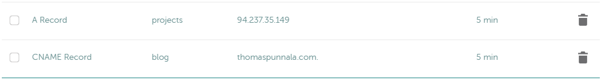  

Varmistetaan että muutokset toimivat.  

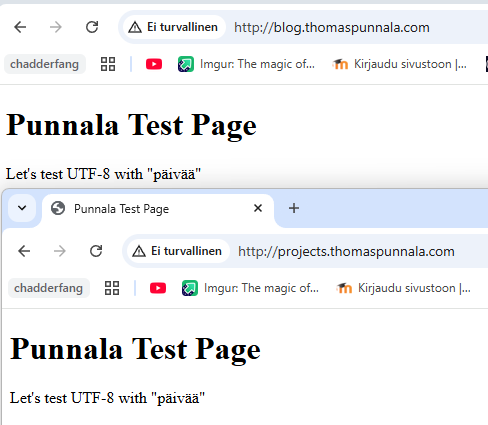  

**CNAME-tietue**: CNAME-tietue yhdistää omassa tapauksessani alidomainin -> päädomainiin. CNAME ei osoita suoraan IP-osoitteeseen vaan domainiin. Tämä on hyödyllinen tapa toteuttaa osoitus, koska nyt IP-muutokset tarvitsee tehdä vain päädomainin A-tietueeseen. Eli jos päädomainin IP-osoite muuttuisi ja alidomain olisi laitettu osoittamaan A-tietueella, joutuisimme muuttamaan alidomainin A-tietueen IP-osoitteen manuaalisesti uuteen. (Cloudfare CNAME)  

### Name based virtual host alidomainille
Alidomainin omaa name based virtual hostia varten kävin tekemässä uuden kansion thomaspunnala.com käyttäjäni kotihakemistoon. Tämän kansion sisään tein uuden kansion projects.thomaspunnala.com, joka sai tiedoston index.html. Lisäsin tiedostoon kuvassa näkyvän sisällön.  

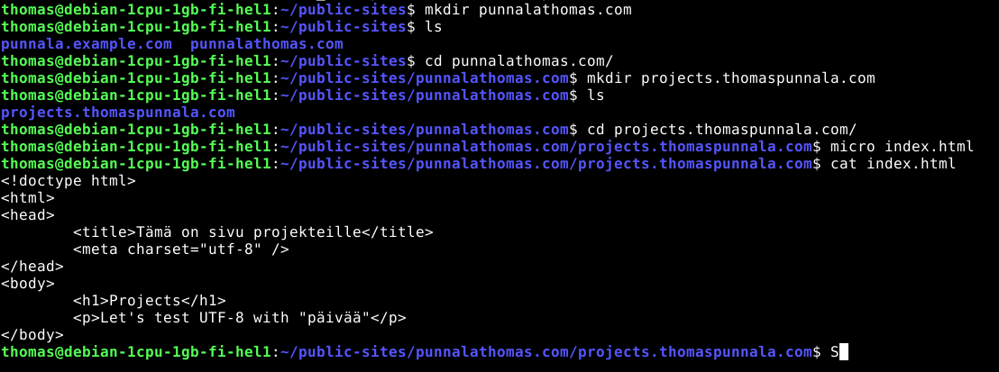  

Tämän jälkeen siirryin hakemistossa `cd /etc/apache2/sites-available` kansioon ja lisäsin sinne alidoimainia varten konfiguraatiota varten tiedoston projects.thomaspunnala.com.conf. Tiedostolle annoin kuvassa näkyvän sisällön. Tämän jälkeen ajoin komennot `sudo a2ensite projects.thomaspunnala.com.conf` ja `sudo systemctl reload apache2`.  

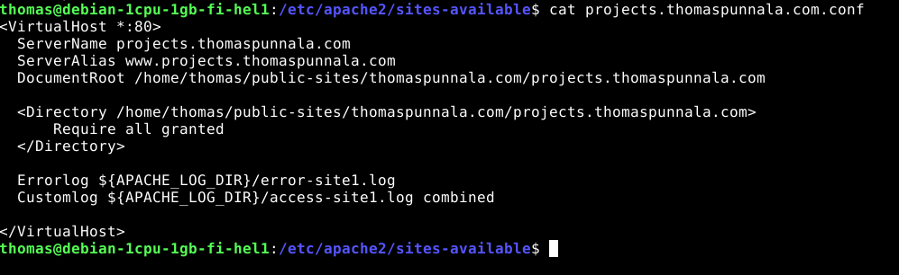  

`curl projects.thomaspunnala.com` antoi seuraavanlaisen errorin. 403 forbidden. On siis aika tarkistaa onko luoduissa tiedostoissa ja kansioissa oikeudet kunnossa.  

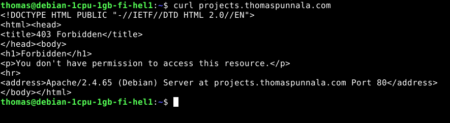  

Ennenkuin pääsin tarkistamaan oikeuksia, huomasin asettaneeni .conf tiedostoon väärän polun. Olin tehnyt alunperin kansion punnalathomas.com, kun minun piti tehdä thomaspunnala.com. Korjasin virheen menemällä public-sites kansioon ja uudelleen nimesin halutun kansion oikeaksi. Tämän jälkeen curl projects.thomaspunnala.com näytti halutun sivun.  

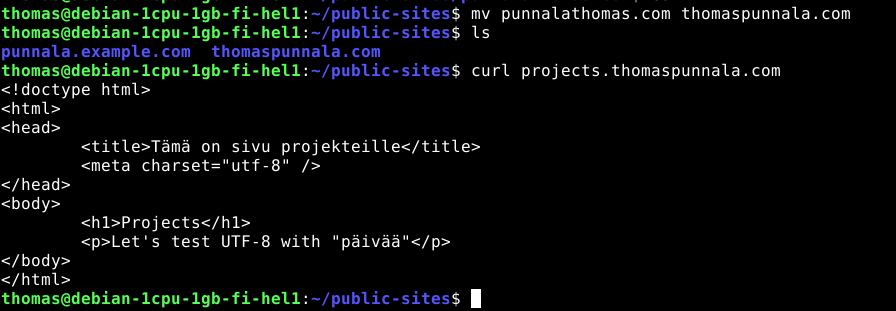  

Nyt ilmeni uusi ongelma, eli jostain syystä projects sivu näkyy nyt kaikilla nimi-hauilla. Eli thomaspunnala.com ja projects.thomaspunnala.com näyttävät saman sisällön. Kokeilin aluksi vaihtaa projects kansiossa olevan index.html tiedostonimen -> projects.html, mutta kaikki sivut sanovat nyt forbidden you dont have permission to access this resource.  

Korjasin ongelman tekemällä uuden konfiguraatiotiedoston (thomaspunnala.com:ille) apachen sites-available kansioon. Muokkasin myös projektin konfiguraatiotiedostoa lisäämällä sinne tämän rivin: DirectoryIndex projects.html, joka kertoo millä nimellä html-tiedosto löytyy. Nyt molemmat sivustot toimivat halutulla tavalla.  

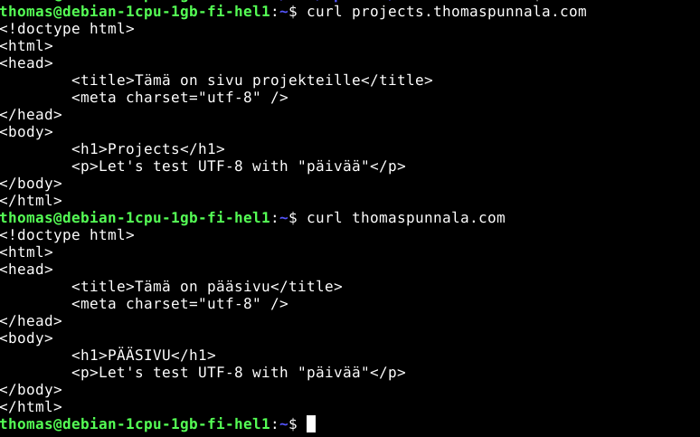  

### DNS-tietojen tutkiminen
**dig-komento**: Dig-komentoa voidaan käyttää DNS-nimipalvelimien kyselyyn. Komennolla saatua tietoa voidaan käyttää esimerkiksi vianmäärityksiin. Yleinen muoto komennolle on `dig @[palvelin, esim IP- tai domain-osoite] [haettavan resurssin nimi] [tyyppi, esim A]`. (Linux.die.net dig)  

**host-komento**: Tätä komentoa käytetään nimien muuntamiseen IP-osoitteiksi ja toisinpäin. Komentoa voidaan käyttää esimerkiksi `host nimi[palvelin]`, eli `host google.com` näyttää A/AAAA/MX-tietueet. (Linux.die.net host)  

Saadakseni komennot toimimaan komentorivillä asensin ensin dnsutils ohjelman komennoilla: `sudo apt-get update` ja `sudo apt-get install dnsutils` (Ariffud, M 2025)  

Tutkimisessa on hyödynnetty seuraavia sivuja: thomaspunnala.com, hakkerointikerhon H-T8, sekä google.com.  

#### Host-komento
`host -C [palvelin]` komennolla saadaan näkyviin SOA(start of authority)-tietue, eli tärkeää tietoa domainista tai vyöhykkeestä, kuten ylläpitäjän sähköpostiosoite, päivitysajankohdan, sekä kuinka kauan palvelin odottaa päivitysten välillä (Cloudfare DNS).  

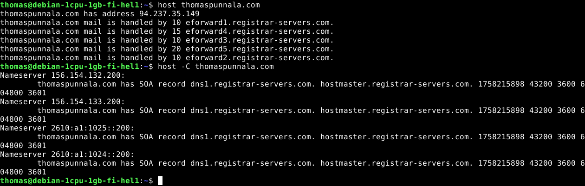  

**thomaspunnala.com**: Komento näyttää sivustolle IPV4-osoitteen, mutta ei IPV6. MX-tietueet ohjataan eforward.registrar-servers.com -palvelimille. Komennolla host -C thomaspunnala.com huomataan, että ensisijainen nimipalvelin on dns1.registrar-servers.com. Nimipalvelimen ylläpitäjän sähköposti on hostmaster@registrar-servers.com.  

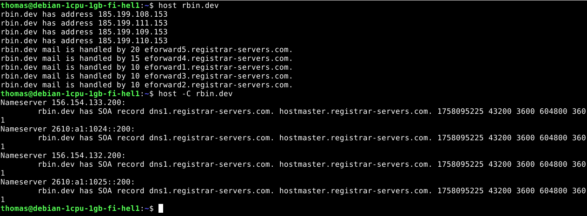  

**rbin.dev**: Nyt voidaan huomata, että IP-osoitteet on jaettu useaan aliverkkoon, tämä lisää sivuston kuormanjakoa. MX-tietueet ovat myös hoidettu domain-rekisteröijän palveluilla, kuten thomaspunnala.comilla. Tästä voidaan tehdä johtopäätös, että domainit on todennäköisesti vuokrattu samasta palvelusta, koska domainien rekisteröinti ja MX-rakenne ovat samanlaiset.  

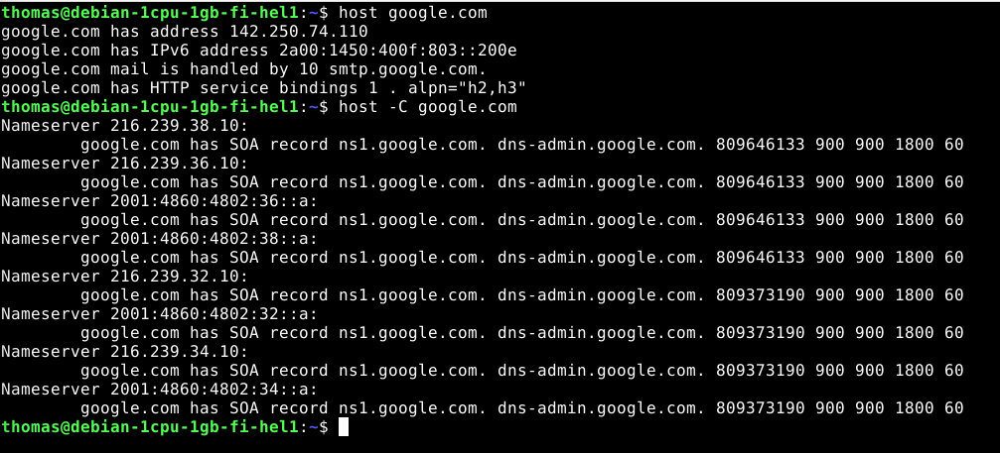  

**google.com**: Huomataan että löytyy IPv4- ja IPv6-osoitteet. Oma sähköpostipalvelin: smtp.google.com. Google hallitsee myös omaa domainiaan itse. Päivitysajankohdat ovat myös lyhyemmät, jolloin googlen DNS-järjestelmä reagoi nopeammin muutoksiin.  

Tämä rivi `google.com has HTTP service bindings 1 . alpn="h2,h3"` kertoo, että google.com tukee HTTP/2- ja HTTP/3-protokollia. Eli asiakkaan ei tarvitse selvittää protkollaa yhteydenmuodostuksen aikana. Tämä nopeuttaa yhteydenmuodostusta. (Datatracker)  

#### Dig-komento
Jos halutaan kaikki tietuetyypit kerralla voidaan käyttää komentoa `dig thomaspunnala.com ANY`. Dig-komento eroaa host-komennosta niin, että dig näyttää myös kyselyn rakenteen: header, question, answer. (Linux.die.net dig)  

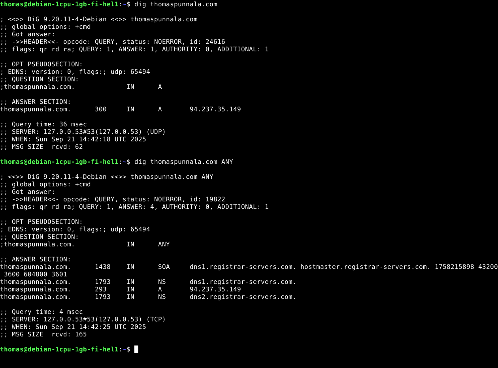  

**thomaspunnala.com**: Nämä kaksi kyselyä näyttivät aikalailla samaa tietoa mitä sain jo host-kohdassa. Nyt voidaan huomata myös että välimuistin keston tietueille, joka on sama 5 minuuttia minkä asetin namecheapin asetuksissa. Myös NS-tietueet, eli ketkä vastaavat domainin DNS-tiedoista.  

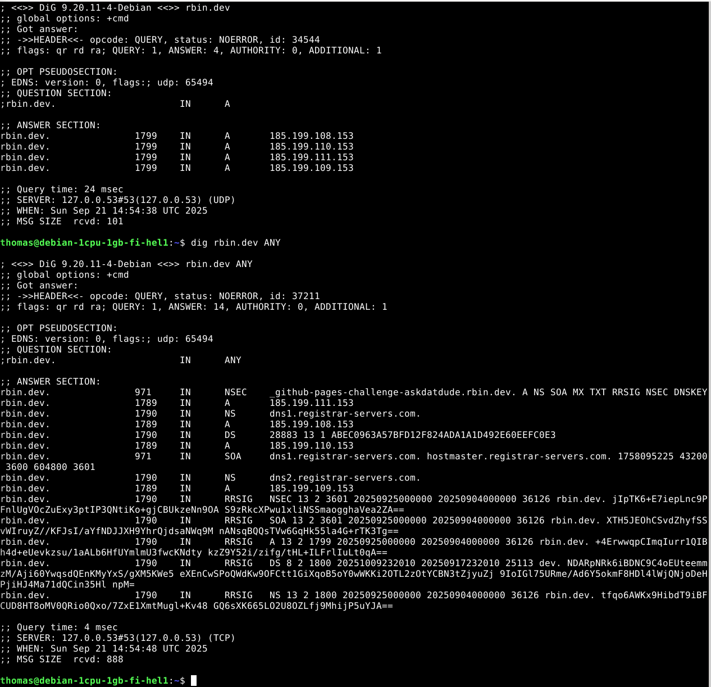  

**rbin.dev**: Tälle sivustolle saatiin myös A-tietueiden TTL-arvot mukaan, joka on 1799 sekunttia. NS-tietueet ovat samat kuin itselläni. Voidaan myös huomata tietueet NSEC, RRSIG ja DNSKEY, jotka kertovat että sivusto tukee DNSSEC:iä. Tämä on DNS-järjestelmän laajennus, joka lisää kryptografisen todennuksen. Voidaan siis varmistua, että DNS-kyselyihin saadut vastaukset tulevat oikeilta auktoritatiiviselta nimipalvelulta ja eivät ole muuttuneet matkalla (Khan, T & Goodwin, M).  

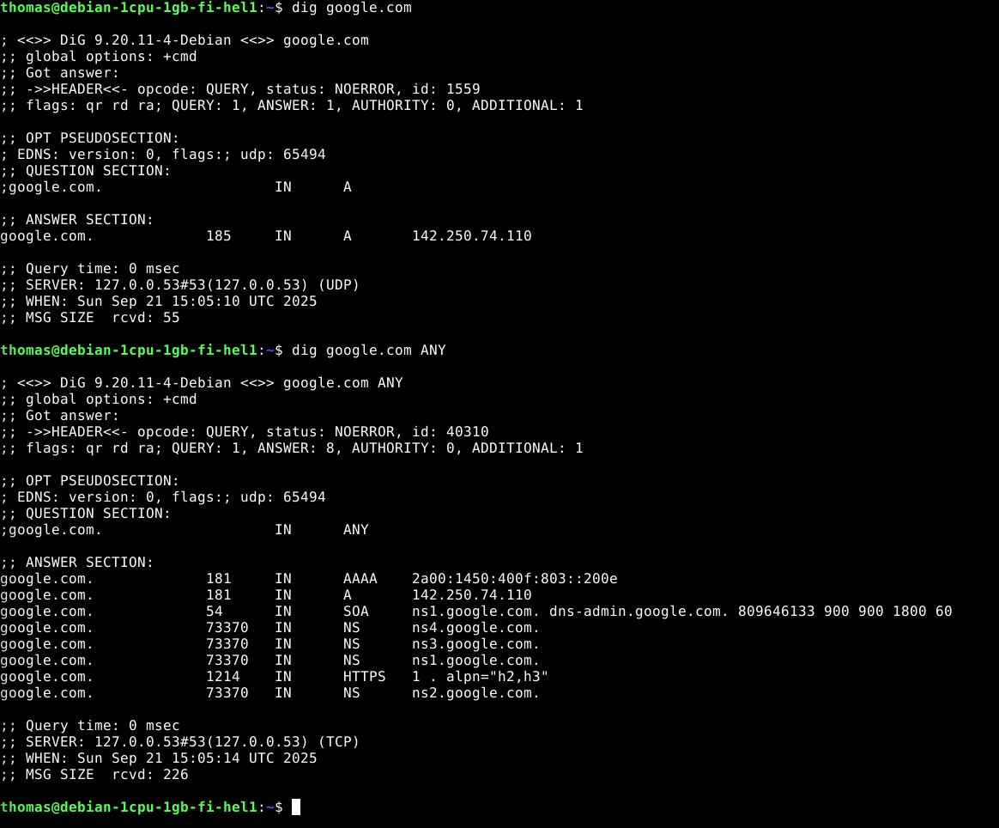  

**google.com**: TTL-arvot olivat hyvin lyhyet A- ja AAAA-tietueille. Dig-kysely paljastikin enemmän tietoa mitä saimme host-komennolla. TTL-arvot, sekä kaikki neljä nimipalvelinta, sekä HTTPS-tietue. Huomasin myös tässä kohtaa, että pelkkä dig-komento haetaan UDP-protokolla ja dig ANY-komento haetaan TCP-protokollalla. Tämä johtunee siitä, että laajempi vastaus ei mahtuisi UDP-protokollaan, joten mennään TCP:llä että saadaan koko vastaus mukaan.  

## Lähteet  
Ariffud, M. 2025. How to use the Linux dig command. Hostinger. Luettavissa: https://www.hostinger.com/tutorials/linux-dig-command#Installing_and_setting_up_dig. Luettu: 21.9.2025  

Datatracker. Service Binding and Parameter Specification via the DNS (SVCB and HTTPS Resource Records). Luettavissa: https://datatracker.ietf.org/doc/rfc9460/. Luettu: 21.9.2025  

Cloudfare. What is a DNS A record?. Luettavissa: https://www.cloudflare.com/learning/dns/dns-records/dns-a-record/. Luettu: 18.9.2025  

Cloudfare. What is time-to-live (TTL)? | TTL definition. Luettavissa: https://www.cloudflare.com/learning/cdn/glossary/time-to-live-ttl/. Luettu: 18.9.2025  

Cloudfare. What is a DNS CNAME record?. Luettavissa: https://www.cloudflare.com/learning/dns/dns-records/dns-cname-record/. Luettu: 18.9.2025  

Cloudfare. What is a DNS SOA record?.https://www.cloudflare.com/learning/dns/dns-records/dns-soa-record/. Luettu: 21.9.2025

Karvinen, T. 2025. Linux Palvelimet 2025 alkusyksy. Luettavissa: https://terokarvinen.com/linux-palvelimet/. Luettu: 18.9.2025  

Khan, T & Goodwin, M. What is DNSSEC (DNS security extensions)?. Luettavissa: https://www.ibm.com/think/topics/dnssec. Luettu: 21.9.2025  

Lavit, C. 2024. What is Domain Renting or Leasing? How Does it Work?. Luettavissa: https://www.atom.com/blog/renting-a-domain/. Luettu: 18.9.2025  

Linux.die.net. dig(1) - Linux man page. Luettavissa: https://linux.die.net/man/1/dig. Luettu: 21.9.2025  

Linux.die.net. host(1) - Linux man page. Luettavissa: https://linux.die.net/man/1/host. Luettu: 21.9.2025  

Namecheap.com. Luettavissa: www.namecheap.com. Luettu: 18.9.2025  

Quora. 2024. Käyttäjän Greenhost:in vastaus kysymykseen: Who owns the ".com" domain? Who started it, why, and when? Why is this not a ".co" or something else instead of "www"?. Luettavissa: https://www.quora.com/Who-owns-the-com-domain-Who-started-it-why-and-when-Why-is-this-not-a-co-or-something-else-instead-of-www. Luettu: 18.9.2025  

Rondina, M. 2025. Why a Domain Name is Important: Benefits, Best Practices, FAQs and More. Luettavissa: https://www.networksolutions.com/blog/why-you-need-a-domain-name/. Luettu: 18.9.2025  

Shawake, E. 2025. What is a subdomain? Definition, examples and setup. WIX. Luettavissa: https://www.wix.com/blog/what-is-a-subdomain. Luettu: 18.9.2025  

