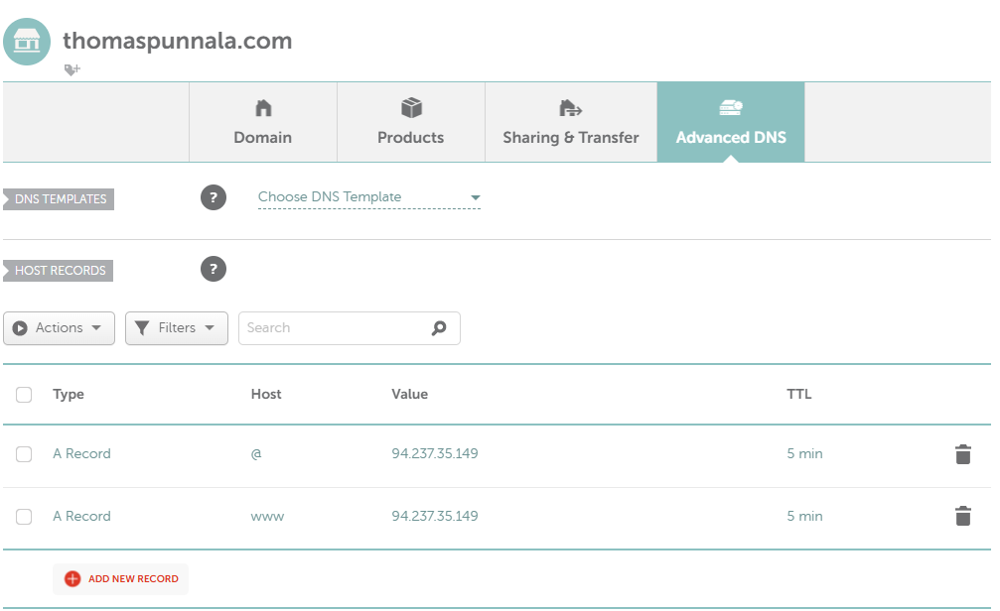

update:

# Lokaali tietokone ja käyttöjärjestelmä
**GPU:** Nvidia RTX 2070  
**Processor:** Intel Core i9-9900K 3.60 Ghz    
**RAM:** 16.0 GB  
**OS:**  Windows 11 Home  

# Virtuaali palvelin
**Template:** Debian GNU/Linux 13 (Trixie)  
**CPU:** 1 core  
**RAM:** 1 GB  
**Storage:** 10 GB  
**Service provider:** UpCloud  

# Nimekäs

## Tiivistelmä
**11.9.25**  
**Aloitusaika**:   
**Lopetusaika**:  
  
Tämän harjoituksen tavoitteet löytyvät Tero Karvisen Linux Palvelimet 2025 alkusyksyn web sivulta kohdasta h5 Nimekäs (Karvinen 2025).  

## Tehtävät

### Domain-nimen vuokraus
**Domain-nimi**: Miksi domain-nimi kannattaa vuokrata tai ostaa? Selitys on yksinkertainen: on huomattavasti helpompi kirjoittaa verkko-osoitteen nimi (google.com), kuin käyttää sen IP-osoitetta (8.8.8.8). Domain-nimen käyttö lisää myös brändisi tunnistettavuutta ja uskottavuutta. Kun käyttäjä miettii nimen valintaa tulisikin sen olla helposti muistettava ja selkeä, nimen päätteenä olisi myös hyvä käyttää esimerkiksi .com:ia. (Rondina 2025).  

Domain-nimen saa helpoiten käyttöönsä esimerkiksi vuokraamalla sen joltakin nimien rekisteröijältä, kuten Namecheapilta. Namecheap hoitaa domainin tietojen rekisteröinnin verkkotunnuspäätteen rekisterkiin, esimerkiksi .com:illa se on Verisign (Greenhost 2024). Namecheap siis vuokraa nimen käyttäjälle vuosi- tai kuukausimaksua vastaan. (Lavit 2024).  

**Vuokraus**: Vuokrasin Namecheapilta nimen thomaspunnala.com, nimi maksoi itselleni noin 12 euroa vuodessa. Vuokraus oli yllättävän helppoa, minun tarvitsi vain etsiä haluamaani domain-nimeä palvelun **Find your new domain name** työkalulla. Kokeilin aluksi vain [sukunimi].comia, mutta tämä oli varattu, päädyin siis ottamaan [etunimi][sukunimi].com:in. Tämän jälkeen valitsin vuokrattavan ajanjakson ja maksoin sen. (namecheap)  

Vuokrauksen jälkeen omaa Domainiaan pääsee säätämään valitsemalla ensin **Account** -> **Dashboard** -> **Domain List** -> Valitaan luotu domain -> **MANAGE**. Itse tein muutokset vain välilehdeltä **Advanced DNS** löytyviin asetuksiin. Poistin HOST RECORD:ista defaulttina löytyneet asetukset ja lisäsin kaksi A-tietuetta osoittamaan palvelimeni IP-osoitteeseen. Asetin myös TTL (TimeToLive) arvon 5 minuuttiin.  

@ tarkoittaa päädomainia, eli tässä tapauksessa thomaspunnala.com. Lisäsin myös alidomainin www osoittamaan samaan IP-osoitteeseen, jolloin sivua voidaan hakea myös www.thomaspunnala.com.  

**A-tietue**: A-tietue yhdistää verkkotunnuksen nimen tiettyyn IP-osoitteeseen. Tämän avulla esimerkiksi selain tietää mihin palvelimeen otetaan yhteys, kun käyttäjä kirjoittaa verkkosivun osoitteen. (Cloudfare DNS A record)  

**Alidomain**: Lyhyesti alidomain on oma sivusto, joka on osa päädoimainia. Alidomain lisätään domain-nimen alkuun, jolloin käyttäjät voidaan ohjata tiettyyn osioon verkkosivustossa. Tämä on helppo tapa rakentaa uusia sivuja ilman uutta domainia. Esimerkiksi blog.thomaspunnala.com olisi alidomain itselleni. (Shwake 2025)   

**TTL**: Time-to-live määrittää kuinka kauan paketti tai tieto välimuistissa on voimassa, kunnes se hylätään ja haetaan uudelleen. Verkkoliikenteessä jokaisella paketilla on oma TTL-arvo, joka pienenee kun se kulkee reitittimen läpi. Kun TTL saavuttaa nollan, reititin poistaa paketin ja lähettää virheilmoituksen lähettäjälle. Tällä estetään pakettien ikuinen kierto verkossa. DNS-tietueissa TTL määrittää kuinka kauan DNS-välimuistipalvelin saa käyttää tallennettua tietuetta, kunnes se haetaan uudelleen alkuperäiseltä palvelimelta. Tämä arvo on hyvä olla pieni alussa, kun halutaan testata uusia ominaisuuksia ja muutoksia. (Cloudfare TTL)  

## Lähteet  
Cloudfare. What is a DNS A record?. Luettavissa: https://www.cloudflare.com/learning/dns/dns-records/dns-a-record/. Luettu: 18.9.2025  

Cloudfare. What is time-to-live (TTL)? | TTL definition. Luettavissa: https://www.cloudflare.com/learning/cdn/glossary/time-to-live-ttl/. Luettu: 18.9.2025  

Karvinen, T. 2025. Linux Palvelimet 2025 alkusyksy. Luettavissa: https://terokarvinen.com/linux-palvelimet/. Luettu: 18.9.2025  

Lavit, C. 2024. What is Domain Renting or Leasing? How Does it Work?. Luettavissa: https://www.atom.com/blog/renting-a-domain/. Luettu: 18.9.2025  

Namecheap.com. Luettavissa: www.namecheap.com. Luettu: 18.9.2025  

Quora. 2024. Käyttäjän Greenhost:in vastaus kysymykseen: Who owns the ".com" domain? Who started it, why, and when? Why is this not a ".co" or something else instead of "www"?. Luettavissa: https://www.quora.com/Who-owns-the-com-domain-Who-started-it-why-and-when-Why-is-this-not-a-co-or-something-else-instead-of-www. Luettu: 18.9.2025  

Rondina, M. 2025. Why a Domain Name is Important: Benefits, Best Practices, FAQs and More. Luettavissa: https://www.networksolutions.com/blog/why-you-need-a-domain-name/. Luettu: 18.9.2025  

Shawake, E. 2025. What is a subdomain? Definition, examples and setup. WIX. Luettavissa: https://www.wix.com/blog/what-is-a-subdomain. Luettu: 18.9.2025  

