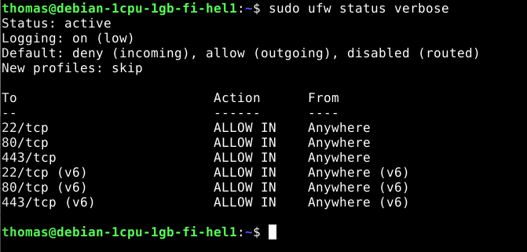
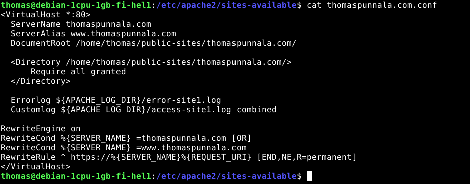
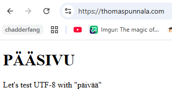
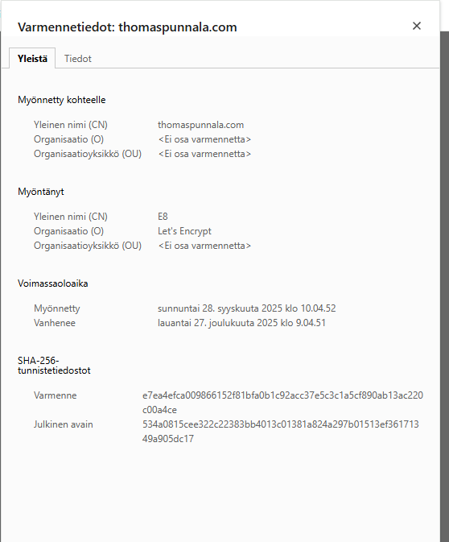
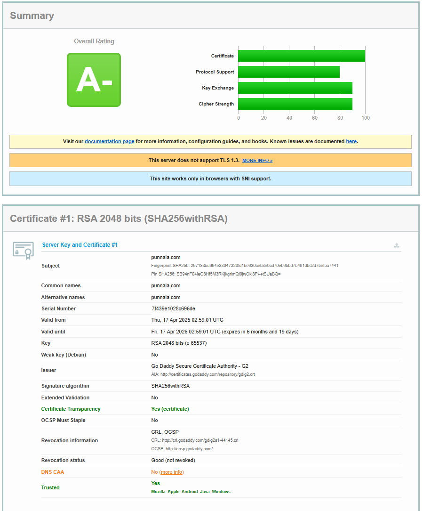
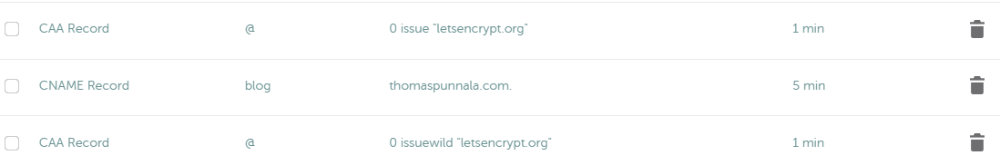
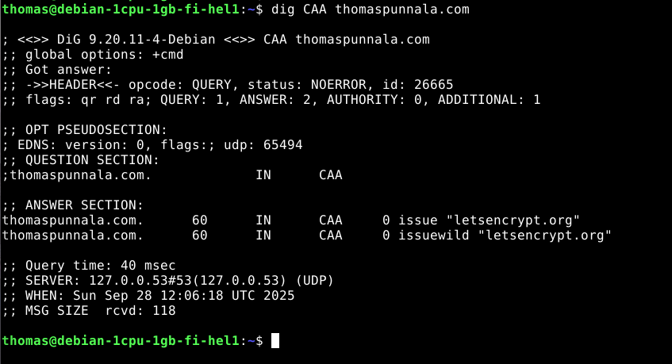
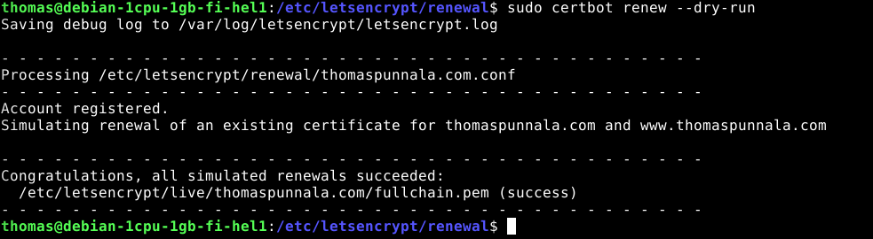

update: 28.9.2025  

# Lokaali tietokone ja käyttöjärjestelmä
**GPU:** Nvidia RTX 2070  
**Processor:** Intel Core i9-9900K 3.60 Ghz    
**RAM:** 16.0 GB  
**OS:**  Windows 11 Home  

# Virtuaali palvelin
**Template:** Debian GNU/Linux 13 (Trixie)  
**CPU:** 1 core  
**RAM:** 1 GB  
**Storage:** 10 GB  
**Service provider:** UpCloud  

# Salataan

## Tiivistelmä
**28.9.25**  
**Aloitusaika**: 12:00  
**Lopetusaika**: 15:00  

Tämän harjoituksen tavoitteet löytyvät Tero Karvisen Linux Palvelimet 2025 alkusyksyn web sivulta kohdasta h6 Salataampa (Karvinen 2025). Tässä tehtävässä oli tarkoituksena hankkia TLS-sertifikaatti Lets Encryptilla, sekä testata oman sivun TLS-ratingia. Tehtävän tekeminen onnistui hyvin ja suurempia ongelmia ei ilmennyt tekemisen aikana. 

## Lets Encrypt
Voidaksemme hankkia automaattisesti selaimen luottamia varmenteita tarvitsee meidän esimerkiksi ajaa ACME-asiakasohjelmaa verkkopalvelimella. Yksinkertaisimmillaan ACME-asiakas todistaa varmentajalle (certificate authority), että verkkotunnusta hallitsee asiakkaan verkkopalvelin. (Lets Encrypt 2025)  

Lets Encrypt tunnistaa ACME-asiakasohjelman sen julkisenavaimen perusteella. Ensimmäisellä yhteydenotolla luodaan avainpari ja todistetaan Lets Encryptin CA:lle, että asiakas hallitsee kyseistä verkkotunnusta. Käytännössä asiakas kysyy kuinka voin todistaa olevani kuka sanon ja Lets Encrypt antaa haasteita joista asiakkaan tulee selvitä. Kun tarkistukset onnistuvat, asiakas saa oikeuden hallita varmenteita kyseiselle verkkotunnukselle. (Lets Encrypt 2025)  

Asiakkaan valtuutuksen jälkeen asiakas voi pyytää, uusia ja peruuttaa varmenteita. (Lets Encrypt 2025)  

## The Apache Software Foundation
Tässä tehtävässä käytämme Certbottia tekemään salaukseen liittyvät asetukset. Apache tarvitsee kuitenkin vähintään seuraavan SSL-asetusten osion:  
```
LoadModule ssl_module modules/mod_ssl.so
Listen 443
<VirtualHost *:443>
    ServerName www.example.com
    SSLEngine on
    SSLCertificateFile "/path/to/www.example.com.cert"
    SSLCertificateKeyFile "/path/to/www.example.com.key"
</VirtualHost>
```
Tällä aktivoidaan SSL:n kuuntelemaan porttia 443 ja määritetään sertifikaatin ja avaimen tiedostot. (Apache 2025)  

## Tehtävät

### TLS-sertifikaatti
Tämän osion lähteenä on käytetty Karvisen (2025) oppitunnin ohjeistusta. Alotin tehtävän tekemisen käynnistämällä lokaalin linux koneen, tämän jälkeen otin yhteyden SSH:lla pilvessä olevaan palvelimeeni.  

Aluksi käynnistin uudelleen apachen komennolla `sudo systemctl restart apache2` ja tarkistin että verkkosivu toimii. Avasin thomaspunnala.com sivun ja totesin että toimii hyvin.  

Seuraavaksi avataan tulimuuriin reikä HTTPS-yhteydelle. Annetaan komento `sudo ufw allow 443/tcp` ja tarkistetaan komennolla `sudo ufw status verbose`, että asetus toimii.  

  

Tämän jälkeen asensin certbotin komennolla `sudo apt-get install certbot python3-certbot-apache`. Seuraavaksi annetaan Certbotille seuraavan komento `sudo certbot --apache --domains thomaspunnala.com,www.thomaspunnala.com`, jolla Certbot hoitaa salaukseen liittyvät asetukset automaattisesti. Asennuksen jälkeen kävin katsomassa thomaspunnala.comin konfiguraatio tiedostoa ja siellä näkyi Certbotin asettamat asetukset.  

  

Kävin katsomassa selaimella thomaspunnala.com ja siellä näkyy että https-yhteys toimii.  

  

Tässä vielä varmennetiedot jossa näkyy Lets Encrypt myöntäjänä.  

  

### Sivun testaus
Aloitin sivun testauksen menemällä Karvisen ohjeiden mukaan Qualysin SSL-testi sivulle ja syötin sinne oman verkkosivuni thomaspunnala.com. Sivusto generoi tämän jälkeen SSL-reportin sivustostani. (Qualys 2025)  

   

Overall rating on A-. Katsoin myös Gianglexin (2025) harjoitustyötä ja huomasin, että itseltäni puuttui myös DNS CAA. Gianglexin mukaan CAA on DNS tietue, joka määrittää ketkä voivat antaa domainille varmenteita. Lähdin korjaamaan tätä raportin ohjeiden mukaan.  

Kirjauduin Namecheapin sivustolle ja kävin lisäämässä CAA-tietueen Advanced DNS asetuksista. Host kohtaan asetin @-merkin (osoittaa omaan domainiini) ja value kohtaan letsencrypt.org. Päädyin tekemään kaksi CAA-tietuetta. Olennaiset erot ovat 0 issue ja 0issuewild. Tämä ei vielä korjannut asiaa testin mukaan, voi olla että tiedot eivät ole päivittyneet vielä.  

  

Kokeilin komentorivillä komentoa `dig CAA thomaspunnala.com` ja se antoi halutun tuloksen, eli CAA on toiminnassa.  

  

Seuraavaksi lähdin tutustumaan sertifikaatin automaattiseen uusimiseen. Löysin Bobcares-sivustolta artikkelin, jossa mainittiin asiasta ja löysin komennon jolla voin tarkistaa onko auto-renew päällä. Ajoin komennon `sudo certbot renew --dry-run`, joka simuloi jo olemassa olevan sertifikaatin uusimista. Tulos toimi, joten oletan sen toimivan halutulla tavalla. (Nikhath 2023)  

Certbot on siis asentanut itse tämän automaattisen uusimisen asennuksen yhteydessä.  

  


## Lähteet
Apache. 2025. SSL/TLS Strong Encryption: How-To. Luettavissa: https://httpd.apache.org/docs/2.4/ssl/ssl_howto.html#configexample. Luettu: 28.9.2025  

Gianglex. 2025. h6-salataanpa. Luettavissa: https://github.com/gianglex/Courses/blob/main/Linux-Palvelimet/h6-salataampa.md. Luettu: 28.9.2025  

Karvinen, T. 2025. Linux Palvelimet 2025 alkusyksy. Luettavissa: https://terokarvinen.com/linux-palvelimet/#h6-salataampa. Luettu: 28.9.2025  

Lets Encrypt. 2025. How It Works. Luettavissa: https://letsencrypt.org/how-it-works/. Luettu: 28.9.2025  

Nikhath, K. 2023. Debian Certbot Auto Renew as easy as 1-2-3. Luettavissa: https://bobcares.com/blog/debian-certbot-auto-renew/. Luettu: 28.9.2025  

Qualys. 2025. SSL Server Test. Luettavissa: https://www.ssllabs.com/ssltest/. Luettu: 28.9.2025  


