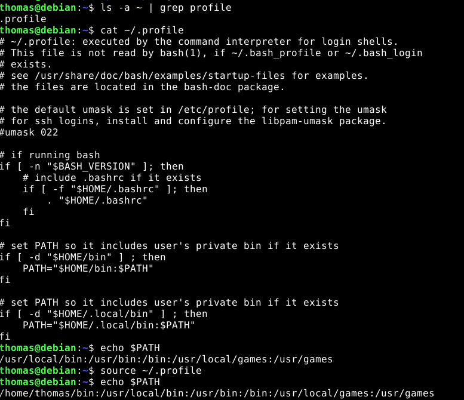
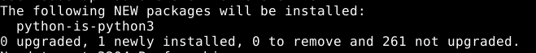
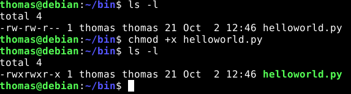
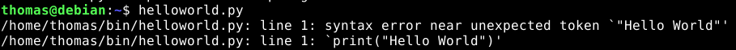
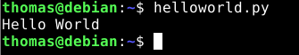
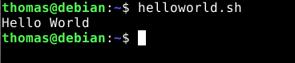
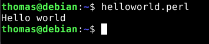

tunnin vinkit:  
oikeudet skriptiin: chmod a+x scripti.sh  
#install docker to debian:
https://docs.docker.com/engine/install/debian/

#docker tutorial
https://docs.docker.com/get-started/docker-overview/

#test docker installation:
sudo docker run hello-world

#download debian13 docker image
sudo docker pull debian:trixie

#run the container, start interactive terminal and bash shell
sudo docker run -it debian:trixie bash

update: 2.10.2025  

# Lokaali tietokone ja käyttöjärjestelmä
**GPU:** Nvidia RTX 2070  
**Processor:** Intel Core i9-9900K 3.60 Ghz    
**RAM:** 16.0 GB  
**OS:**  Windows 11 Home  

# Virtuaali palvelin
**Template:** Debian GNU/Linux 13 (Trixie)  
**CPU:** 1 core  
**RAM:** 1 GB  
**Storage:** 10 GB  
**Service provider:** UpCloud  

# Maalisuora

## Tiivistelmä
**2.10.25**  
**Aloitusaika**: 12:15    
**Lopetusaika**: 

Tämän harjoituksen tavoitteet löytyvät Tero Karvisen Linux Palvelimet 2025 alkusyksyn web sivulta kohdasta h7 Maalisuora (Karvinen 2025). Tein harjoitukset paikallisella virtuaalikoneellani.  

## Hello world
Ajoin aluksi komennon `sudo apt-get update`, koska tiesin lataavani uusia ohjelmia tehtävää varten. Halusin myös ajaa kommennot ilman ./ alkua, tein kotihakemistooni bin kansion. Tarkistin myös löytyykö .profile tiedostosta tarvittavat tiedot komennoilla, `$ ls -a ~ | grep profile` ja `cat ~/.profile`. Tiedostossa oli kaikki oikein joten testasin nyt toimiiko komento `echo $PATH` haluamallani tavalla. Aluksi se palautti /usr/ alkuisen polun, mutta latasin .profilen uudelleen komennolla `source ~/.profile` ja uudestaan `echo $PATH`. Nyt polku on /home/thomas/ alkuinen. Seuraavaksi laitan tulevat scriptit tuonne kotihakemiston /bin/ -kansioon, jolloin komentojen tulisi toimia ilman ./ -alkua. (Heinonen 2025)  

   

### Python
Tarkistin aluksi onko Python asennettuna virtuaalikoneellani komennolla `python3 --version`, joka palautti minulle `Python 3.13.5`. Eli ohjelma löytyy koneelta. Seuraavaksi halusin käyttää python3 -> python shortcutilla. Hyödynsin tässä Heinosen (2025) ohjetta ja ajoin komennon `sudo apt-get install python-is-python3`. Komennon jälkeen alkoi asennus ja mielestäni tärkein kohta siitä on alla olevassa kuvassa, eli `python-is-python3`. (Heinonen 2025)   

  

Tämän jälkeen siirryin kotihakemistossa /bin/ -kansioon komennolla `cd bin` ja loin Python tiedoston helloworld.py komennolla `nano helloworld.py`. Annoin tiedostolle seuraavanlaisen sisällön: `print("Hello World")` ja tallensin sen. Tarkistin myös ohjelmani oikeudet `ls -l` ja korjasin ne oikeaksi komennolla `chmod +x helloworld.py`, tarkistin vielä tulivatko ne voimaan ja hyvältä näytti.  

  

Tämän jälkeen oli aika kokeilla toimiiko se, eli ajetaan komento `helloworld.py`. Sain seuraavanlaisen virheen aluksi:  

  

Olin unohtanut laittaa python-tiedoston alkuun `#!/usr/bin/env python3`, joten tämän muutoksen jälkeen ohjelma toimi halutulla tavalla.  

  

### Bash
Siirryin taas kotihakemistoni bin-kansioon ja loin sinne helloworld.sh -tiedoston. Tiedostolle annoin seuraavan sisällön:
```
#!/bin/bash

echo "Hello World"
```
Tämän jälkeen oikeudet kuntoon komennolla `chmod +x helloworld.sh` ja kokeillaan toimintaa komennolla `helloworld.sh`. Hyvin näytti toimivan.  

  

### Perl
Aluksi tarkistin löytyykö Perl koneeltani komennolla `perl -v`, tämä palautti perl 5, version 40. Eli ohjelma löytyy. Nyt luodaan tiedosto samalla tavalla kuin aikaisemmin. `nano helloworld.perl` ja annetaan sisällöksi:  
```
#!/usr/bin/env perl
print "Hello world\n";
```

Oikeudet kuntoon ja ajetaan ->. (Geeksforgeeks 2025)   

  


## Lähteet
Geeksforgeeks. 2025. Hello World Program in Perl. Luettavissa: https://www.geeksforgeeks.org/perl/hello-world-program-in-perl/. Luettu: 2.10.2025  

Heinonen, J. 2025. linux-01102025.md. Luettavissa: https://github.com/johannaheinonen/johanna-test-repo/blob/main/linux-01102025.md. Luettu: 2.10.2025  

Karvinen, T. 2025. Linux Palvelimet 2025 alkusyksy. Luettavissa: https://terokarvinen.com/linux-palvelimet/. Luettu: 2.10.2025  

